# [陈迅雷_ratSquealer_22]	3week

## 更新内容

第二周：

1. 测试程序从SpringBoot项目改为简单程序（不依赖第三方库）
2. 产生初始GC（gc1.log）日志，并进行具体分析

第三周：

1. 测试线程数量影响，分析原因
1. 修改测试程序
1. 测试堆大小的影响，分析原因
1. 规划下周测试内容**（待定）**

第四周：

1. 重新设计程序：使部分byte[]对象能够存活更长的时间；控制对象产生大小，以达到调整创建对象（消耗内存）的速率
1. 因为控制速率和代码重新修改，将从堆内存，重新进行测试

注意：虽然前面因为知识储备、实际操作问题，导致前面部分大多已经舍弃，但是暂不删除其内容（出于工作量考虑），可以直接从这里直接跳转到[新的调优版本](#五、调优：代码重制版)


## 一、背景与考虑方面

### 1.1 背景

一般的应用程序，对于GC的选择不是特别重要，应用程序可以在垃圾收集的情况下以适度的频率和持续时间暂停，表现良好。

但是对于拥有大量数据、多线程和高事务率的应用程序需要设计对应的GC和参数。

针对Parallel GC，编写程序模拟内存分配与垃圾回收场景，能够反应出该GC的特点。解释它的GC日志。修改程序或JVM参数以达成特定目标，如更低的GC延迟。


### 1.2 考虑方面

Parallel GC 的内存分配与垃圾回收场景反映其特点的几个方面包括：

1. **年轻代垃圾回收**：多线程进行垃圾收集，加速年轻代对象的清理。
2. **老年代垃圾回收**：多线程处理老年代对象，提高吞吐量。
3. **暂停时间**：尽量降低暂停时间，提高应用程序的响应速度。
4. **吞吐量优化**：提高总体吞吐量，应对高效处理大量事务的应用程序。

## 二、代码程序与JVM参数

### 2.1 Java代码

通过不断创建并添加1MB大小的字节数组到一个**ArrayList**中，然后每迭代100次清空一次**list**来触发垃圾回收。通过这种方式，测试和观察Java垃圾回收机制的行为和性能。

```java
public class ParallelGCTest {
    public static void main(String[] args) {
        List<byte[]> list = new ArrayList<>();
        int counter = 0;
        int maxIterations = 1500;  // 设置最大迭代次数，避免无限运行
        while (counter < maxIterations) {
            list.add(new byte[1024 * 1024]);
            if (++counter % 100 == 0) {
                list.clear();
                System.out.println("Iteration: " + counter + " - Cleared list to trigger GC");
            }
            try {
                Thread.sleep(10);
            } catch (InterruptedException e) {
                Thread.currentThread().interrupt();
                break;
            }
        }
        System.out.println("Test completed");
    }
}	
```

### 2.2 JVM命令

```java
-XX:+UseParallelGC		//使用并行垃圾收集器（Parallel GC）
-Xlog:gc*:file=gc.log	//启用GC日志记录
```

## 三、GC日志分析

<details>
    <summary>点击展开/折叠日志</summary>

```log
[0.007s][info][gc] Using Parallel
[0.008s][info][gc,init] Version: 17.0.11+7-LTS-207 (release)
[0.009s][info][gc,init] CPUs: 12 total, 12 available
[0.009s][info][gc,init] Memory: 32620M
[0.009s][info][gc,init] Large Page Support: Disabled
[0.009s][info][gc,init] NUMA Support: Disabled
[0.009s][info][gc,init] Compressed Oops: Enabled (Zero based)
[0.009s][info][gc,init] Alignments: Space 512K, Generation 512K, Heap 2M
[0.009s][info][gc,init] Heap Min Capacity: 8M
[0.009s][info][gc,init] Heap Initial Capacity: 510M
[0.009s][info][gc,init] Heap Max Capacity: 8156M
[0.009s][info][gc,init] Pre-touch: Disabled
[0.009s][info][gc,init] Parallel Workers: 10
[0.017s][info][gc,metaspace] CDS archive(s) mapped at: [0x000002281f000000-0x000002281fbd0000-0x000002281fbd0000), size 12386304, SharedBaseAddress: 0x000002281f000000, ArchiveRelocationMode: 1.
[0.017s][info][gc,metaspace] Compressed class space mapped at: 0x0000022820000000-0x0000022860000000, reserved size: 1073741824
[0.017s][info][gc,metaspace] Narrow klass base: 0x000002281f000000, Narrow klass shift: 0, Narrow klass range: 0x100000000
[1.881s][info][gc,start    ] GC(0) Pause Young (Allocation Failure)
[1.884s][info][gc,heap     ] GC(0) PSYoungGen: 130869K(152576K)->18312K(152576K) Eden: 130869K(131072K)->0K(131072K) From: 0K(21504K)->18312K(21504K)
[1.884s][info][gc,heap     ] GC(0) ParOldGen: 0K(348160K)->8K(348160K)
[1.884s][info][gc,metaspace] GC(0) Metaspace: 1040K(1216K)->1040K(1216K) NonClass: 953K(1024K)->953K(1024K) Class: 86K(192K)->86K(192K)
[1.884s][info][gc          ] GC(0) Pause Young (Allocation Failure) 127M->17M(489M) 2.728ms
[1.884s][info][gc,cpu      ] GC(0) User=0.00s Sys=0.00s Real=0.00s
[3.868s][info][gc,start    ] GC(1) Pause Young (Allocation Failure)
[3.873s][info][gc,heap     ] GC(1) PSYoungGen: 148804K(152576K)->21336K(152576K) Eden: 130492K(131072K)->0K(131072K) From: 18312K(21504K)->21336K(21504K)
[3.873s][info][gc,heap     ] GC(1) ParOldGen: 8K(348160K)->24592K(348160K)
[3.873s][info][gc,metaspace] GC(1) Metaspace: 1042K(1216K)->1042K(1216K) NonClass: 955K(1024K)->955K(1024K) Class: 86K(192K)->86K(192K)
[3.873s][info][gc          ] GC(1) Pause Young (Allocation Failure) 145M->44M(489M) 4.793ms
[3.873s][info][gc,cpu      ] GC(1) User=0.00s Sys=0.00s Real=0.01s
[5.848s][info][gc,start    ] GC(2) Pause Young (Allocation Failure)
[5.855s][info][gc,heap     ] GC(2) PSYoungGen: 151867K(152576K)->21352K(152576K) Eden: 130530K(131072K)->0K(131072K) From: 21336K(21504K)->21352K(21504K)
[5.855s][info][gc,heap     ] GC(2) ParOldGen: 24592K(348160K)->76825K(348160K)
[5.855s][info][gc,metaspace] GC(2) Metaspace: 1042K(1216K)->1042K(1216K) NonClass: 955K(1024K)->955K(1024K) Class: 86K(192K)->86K(192K)
[5.855s][info][gc          ] GC(2) Pause Young (Allocation Failure) 172M->95M(489M) 6.550ms
[5.855s][info][gc,cpu      ] GC(2) User=0.00s Sys=0.00s Real=0.01s
[7.852s][info][gc,start    ] GC(3) Pause Young (Allocation Failure)
[7.861s][info][gc,heap     ] GC(3) PSYoungGen: 151912K(152576K)->21256K(152576K) Eden: 130559K(131072K)->0K(131072K) From: 21352K(21504K)->21256K(21504K)
[7.861s][info][gc,heap     ] GC(3) ParOldGen: 76825K(348160K)->156698K(348160K)
[7.861s][info][gc,metaspace] GC(3) Metaspace: 1042K(1216K)->1042K(1216K) NonClass: 955K(1024K)->955K(1024K) Class: 86K(192K)->86K(192K)
[7.861s][info][gc          ] GC(3) Pause Young (Allocation Failure) 223M->173M(489M) 9.136ms
[7.861s][info][gc,cpu      ] GC(3) User=0.00s Sys=0.00s Real=0.01s
[9.851s][info][gc,start    ] GC(4) Pause Young (Allocation Failure)
[9.854s][info][gc,heap     ] GC(4) PSYoungGen: 151834K(152576K)->21320K(149504K) Eden: 130578K(131072K)->0K(128000K) From: 21256K(21504K)->21320K(21504K)
[9.854s][info][gc,heap     ] GC(4) ParOldGen: 156698K(348160K)->161818K(348160K)
[9.854s][info][gc,metaspace] GC(4) Metaspace: 1042K(1216K)->1042K(1216K) NonClass: 955K(1024K)->955K(1024K) Class: 86K(192K)->86K(192K)
[9.854s][info][gc          ] GC(4) Pause Young (Allocation Failure) 301M->178M(486M) 2.315ms
[9.854s][info][gc,cpu      ] GC(4) User=0.00s Sys=0.00s Real=0.00s
[11.785s][info][gc,start    ] GC(5) Pause Young (Allocation Failure)
[11.790s][info][gc,heap     ] GC(5) PSYoungGen: 148778K(149504K)->21288K(146432K) Eden: 127457K(128000K)->0K(124928K) From: 21320K(21504K)->21288K(21504K)
[11.790s][info][gc,heap     ] GC(5) ParOldGen: 161818K(348160K)->191514K(348160K)
[11.790s][info][gc,metaspace] GC(5) Metaspace: 1042K(1216K)->1042K(1216K) NonClass: 955K(1024K)->955K(1024K) Class: 86K(192K)->86K(192K)
[11.790s][info][gc          ] GC(5) Pause Young (Allocation Failure) 303M->207M(483M) 4.563ms
[11.790s][info][gc,cpu      ] GC(5) User=0.00s Sys=0.00s Real=0.00s
[13.672s][info][gc,start    ] GC(6) Pause Young (Allocation Failure)
[13.679s][info][gc,heap     ] GC(6) PSYoungGen: 145621K(146432K)->22528K(145408K) Eden: 124332K(124928K)->0K(122368K) From: 21288K(21504K)->22528K(23040K)
[13.679s][info][gc,heap     ] GC(6) ParOldGen: 191514K(348160K)->241385K(348160K)
[13.679s][info][gc,metaspace] GC(6) Metaspace: 1042K(1216K)->1042K(1216K) NonClass: 955K(1024K)->955K(1024K) Class: 86K(192K)->86K(192K)
[13.679s][info][gc          ] GC(6) Pause Young (Allocation Failure) 329M->257M(482M) 6.875ms
[13.679s][info][gc,cpu      ] GC(6) User=0.00s Sys=0.02s Real=0.01s
[15.550s][info][gc,start    ] GC(7) Pause Young (Allocation Failure)
[15.559s][info][gc,heap     ] GC(7) PSYoungGen: 144767K(145408K)->17408K(137728K) Eden: 122239K(122368K)->0K(119808K) From: 22528K(23040K)->17408K(17920K)
[15.559s][info][gc,heap     ] GC(7) ParOldGen: 241385K(348160K)->314090K(348160K)
[15.559s][info][gc,metaspace] GC(7) Metaspace: 1042K(1216K)->1042K(1216K) NonClass: 955K(1024K)->955K(1024K) Class: 86K(192K)->86K(192K)
[15.559s][info][gc          ] GC(7) Pause Young (Allocation Failure) 377M->323M(474M) 8.404ms
[15.559s][info][gc,cpu      ] GC(7) User=0.00s Sys=0.00s Real=0.01s
[15.559s][info][gc,start    ] GC(8) Pause Full (Ergonomics)
[15.559s][info][gc,phases,start] GC(8) Marking Phase
[15.560s][info][gc,phases      ] GC(8) Marking Phase 1.040ms
[15.560s][info][gc,phases,start] GC(8) Summary Phase
[15.560s][info][gc,phases      ] GC(8) Summary Phase 0.017ms
[15.560s][info][gc,phases,start] GC(8) Adjust Roots
[15.560s][info][gc,phases      ] GC(8) Adjust Roots 0.400ms
[15.560s][info][gc,phases,start] GC(8) Compaction Phase
[15.566s][info][gc,phases      ] GC(8) Compaction Phase 6.148ms
[15.566s][info][gc,phases,start] GC(8) Post Compact
[15.570s][info][gc,phases      ] GC(8) Post Compact 3.216ms
[15.570s][info][gc,heap        ] GC(8) PSYoungGen: 17408K(137728K)->0K(117760K) Eden: 0K(119808K)->0K(117248K) From: 17408K(17920K)->0K(512K)
[15.570s][info][gc,heap        ] GC(8) ParOldGen: 314090K(348160K)->91803K(318464K)
[15.570s][info][gc,metaspace   ] GC(8) Metaspace: 1042K(1216K)->1042K(1216K) NonClass: 955K(1024K)->955K(1024K) Class: 86K(192K)->86K(192K)
[15.570s][info][gc             ] GC(8) Pause Full (Ergonomics) 323M->89M(426M) 11.350ms
[15.570s][info][gc,cpu         ] GC(8) User=0.00s Sys=0.00s Real=0.01s
[17.351s][info][gc,start       ] GC(9) Pause Young (Allocation Failure)
[17.352s][info][gc,heap        ] GC(9) PSYoungGen: 117020K(117760K)->2048K(138240K) Eden: 117020K(117248K)->0K(114176K) From: 0K(512K)->2048K(24064K)
[17.352s][info][gc,heap        ] GC(9) ParOldGen: 91803K(318464K)->91803K(318464K)
[17.352s][info][gc,metaspace   ] GC(9) Metaspace: 1042K(1216K)->1042K(1216K) NonClass: 955K(1024K)->955K(1024K) Class: 86K(192K)->86K(192K)
[17.352s][info][gc             ] GC(9) Pause Young (Allocation Failure) 203M->91M(446M) 0.387ms
[17.352s][info][gc,cpu         ] GC(9) User=0.00s Sys=0.00s Real=0.00s
[19.090s][info][gc,start       ] GC(10) Pause Young (Allocation Failure)
[19.091s][info][gc,heap        ] GC(10) PSYoungGen: 115917K(138240K)->13312K(125440K) Eden: 113869K(114176K)->0K(111616K) From: 2048K(24064K)->13312K(13824K)
[19.091s][info][gc,heap        ] GC(10) ParOldGen: 91803K(318464K)->91803K(318464K)
[19.091s][info][gc,metaspace   ] GC(10) Metaspace: 1042K(1216K)->1042K(1216K) NonClass: 955K(1024K)->955K(1024K) Class: 86K(192K)->86K(192K)
[19.091s][info][gc             ] GC(10) Pause Young (Allocation Failure) 202M->102M(433M) 1.163ms
[19.091s][info][gc,cpu         ] GC(10) User=0.00s Sys=0.00s Real=0.00s
[20.775s][info][gc,start       ] GC(11) Pause Young (Allocation Failure)
[20.777s][info][gc,heap        ] GC(11) PSYoungGen: 124068K(125440K)->21504K(134656K) Eden: 110756K(111616K)->0K(109056K) From: 13312K(13824K)->21504K(25600K)
[20.777s][info][gc,heap        ] GC(11) ParOldGen: 91803K(318464K)->91803K(318464K)
[20.777s][info][gc,metaspace   ] GC(11) Metaspace: 1042K(1216K)->1042K(1216K) NonClass: 955K(1024K)->955K(1024K) Class: 86K(192K)->86K(192K)
[20.777s][info][gc             ] GC(11) Pause Young (Allocation Failure) 210M->110M(442M) 1.932ms
[20.777s][info][gc,cpu         ] GC(11) User=0.00s Sys=0.00s Real=0.00s
[22.433s][info][gc,start       ] GC(12) Pause Young (Allocation Failure)
[22.435s][info][gc,heap        ] GC(12) PSYoungGen: 130168K(134656K)->26624K(134656K) Eden: 108663K(109056K)->0K(107008K) From: 21504K(25600K)->26624K(27648K)
[22.435s][info][gc,heap        ] GC(12) ParOldGen: 91803K(318464K)->92827K(318464K)
[22.435s][info][gc,metaspace   ] GC(12) Metaspace: 1042K(1216K)->1042K(1216K) NonClass: 955K(1024K)->955K(1024K) Class: 86K(192K)->86K(192K)
[22.435s][info][gc             ] GC(12) Pause Young (Allocation Failure) 216M->116M(442M) 2.036ms
[22.435s][info][gc,cpu         ] GC(12) User=0.00s Sys=0.00s Real=0.00s
[23.573s][info][gc,heap,exit   ] Heap
[23.573s][info][gc,heap,exit   ]  PSYoungGen      total 134656K, used 103599K [0x0000000756180000, 0x0000000760400000, 0x0000000800000000)
[23.573s][info][gc,heap,exit   ]   eden space 107008K, 71% used [0x0000000756180000,0x000000075acabe30,0x000000075ca00000)
[23.573s][info][gc,heap,exit   ]   from space 27648K, 96% used [0x000000075cc00000,0x000000075e6001a0,0x000000075e700000)
[23.573s][info][gc,heap,exit   ]   to   space 29696K, 0% used [0x000000075e700000,0x000000075e700000,0x0000000760400000)
[23.573s][info][gc,heap,exit   ]  ParOldGen       total 318464K, used 92827K [0x0000000602400000, 0x0000000615b00000, 0x0000000756180000)
[23.573s][info][gc,heap,exit   ]   object space 318464K, 29% used [0x0000000602400000,0x0000000607ea6cc0,0x0000000615b00000)
[23.573s][info][gc,heap,exit   ]  Metaspace       used 1043K, committed 1216K, reserved 1114112K
[23.573s][info][gc,heap,exit   ]   class space    used 86K, committed 192K, reserved 1048576K

```

</details>

### 3.1 设备信息和jvm参数日志

| 日志信息                                                     | 解释                                                         |
| :----------------------------------------------------------- | ------------------------------------------------------------ |
| [0.007s][info][gc] Using Parallel                            | JVM使用并行垃圾回收器（Parallel GC）                         |
| [0.008s][info][gc,init] Version: 17.0.11+7-LTS-207 (release) | JVM的版本是17.0.11（长期支持）                               |
| [0.009s][info][gc,init] CPUs: 12 total, 12 available         | 系统总共有12个CPU核心，全部可用                              |
| [0.009s][info][gc,init] Memory: 32620M                       | 系统总内存为32620MB（约32GB）                                |
| [0.009s][info][gc,init] Large Page Support: Disabled         | 大页面支持已禁用（大页面可以提高内存管理的效率，但在此配置中未启用） |
| [0.009s][info][gc,init] NUMA Support: Disabled               | 非一致性内存访问（NUMA）支持已禁用（NUMA是多处理器系统的一种内存设计方法，可以提高性能） |
| [0.009s][info][gc,init] Compressed Oops: Enabled (Zero based) | 压缩指针（Compressed Oops）已启用，采用零基址。（压缩指针可以减少64位JVM的内存消耗） |
| [0.009s][info][gc,init] Alignments: Space 512K, Generation 512K, Heap 2M | 空间、代、堆的对齐大小分别是512K、512K和2M                   |
| [0.009s][info][gc,init] Heap Min Capacity: 8M                | 堆的最小容量为8MB                                            |
| [0.009s][info][gc,init] Heap Initial Capacity: 510M          | 堆的初始容量为510MB                                          |
| [0.009s][info][gc,init] Heap Max Capacity: 8156M             | 堆的最大容量为8156MB（约8GB）                                |
| [0.009s][info][gc,init] Pre-touch: Disabled                  | Pre-touch功能已禁用（Pre-touch在JVM启动时会预先触碰所有的页面，以减少运行时的页面错误） |
| [0.009s][info][gc,init] Parallel Workers: 10                 | 并行垃圾回收器的工作线程数为10                               |

### 3.2 GC日志分析

<details>
    <summary>GC详情日志分析</summary>

| GC次数、时间戳 | 日志分析                                                     |
| :------------- | :----------------------------------------------------------- |
| GC(0) 1.881秒  | 触发GC的原因：由于Eden区没有足够的空间来容纳新对象，导致分配失败。 <br />PSYoungGen：年轻代内存从130869K（总152576K）减少到18312K（总152576K）。Eden区内存从130869K（总131072K）减少到0K（总131072K），表明Eden区的对象要么被回收，要么被移动到Survivor区或老年代。From Survivor区的内存从0K（总21504K）增加到18312K（总21504K），表示一些对象从Eden区移到了From Survivor区。 <br />ParOldGen：老年代内存从0K（总348160K）增加到8K（总348160K），表示一些对象从年轻代晋升到了老年代。 <br />内存减少：总内存从127MB减少到17MB，显著减少了内存使用。<br /> GC暂停信息：整个GC事件花费了2.728毫秒，期间应用程序暂停运行。<br /> CPU时间：CPU的用户态和系统态时间均为0秒，对CPU资源的使用极少。 |
| GC(1) 3.868秒  | 触发GC的原因：由于Eden区没有足够的空间来容纳新对象，导致分配失败。 <br />PSYoungGen：年轻代内存从148804K（总152576K）减少到21336K（总152576K）。Eden区内存从130492K（总131072K）减少到0K（总131072K），表明Eden区的对象要么被回收，要么被移动到Survivor区或老年代。From Survivor区的内存从18312K（总21504K）增加到21336K（总21504K），表示一些对象从Eden区移到了From Survivor区。 <br />ParOldGen：老年代内存从8K（总348160K）增加到24592K（总348160K），表示更多的对象从年轻代晋升到了老年代。<br / >内存减少：总内存从145MB减少到44MB，显著减少了内存使用。 <br />GC暂停信息：整个GC事件花费了4.793毫秒，期间应用程序暂停运行。 <br />CPU时间：CPU的用户态和系统态时间均为0秒，对CPU资源的使用极少，实际时间为0.01秒。 |
| GC(2) 5.848秒  | 触发GC的原因：由于Eden区没有足够的空间来容纳新对象，导致分配失败。 <br />PSYoungGen：年轻代内存从151867K（总152576K）减少到21352K（总152576K）。Eden区内存从130530K（总131072K）减少到0K（总131072K），表明Eden区的对象要么被回收，要么被移动到Survivor区或老年代。From Survivor区的内存从21336K（总21504K）增加到21352K（总21504K），表示一些对象从Eden区移到了From Survivor区。 <br />ParOldGen：老年代内存从24592K（总348160K）增加到76825K（总348160K），表示更多的对象从年轻代晋升到了老年代。 <br />内存减少：总内存从172MB减少到95MB，显著减少了内存使用。 <br />GC暂停信息：整个GC事件花费了6.550毫秒，期间应用程序暂停运行。<br />CPU时间：CPU的用户态和系统态时间均为0秒，对CPU资源的使用极少，实际时间为0.01秒。 |
| GC(3) 7.852秒  | 触发GC的原因：由于Eden区没有足够的空间来容纳新对象，导致分配失败。 <br />PSYoungGen：年轻代内存从151912K（总152576K）减少到21256K（总152576K）。Eden区内存从130559K（总131072K）减少到0K（总131072K），表明Eden区的对象要么被回收，要么被移动到Survivor区或老年代。From Survivor区的内存从21352K（总21504K）减少到21256K（总21504K），表示一些对象从Eden区移到了From Survivor区。 <br />ParOldGen：老年代内存从76825K（总348160K）增加到156698K（总348160K），表示更多的对象从年轻代晋升到了老年代。 <br />内存减少：总内存从223MB减少到173MB，显著减少了内存使用。<br />GC暂停信息：整个GC事件花费了9.136毫秒，期间应用程序暂停运行。 <br />CPU时间：CPU的用户态和系统态时间均为0秒，对CPU资源的使用极少，实际时间为0.01秒。 |
| GC(4) 9.851秒  | 触发GC的原因：由于Eden区没有足够的空间来容纳新对象，导致分配失败。 <br />PSYoungGen：年轻代内存从151834K（总152576K）减少到21320K（总149504K）。Eden区内存从130578K（总131072K）减少到0K（总128000K），表明Eden区的对象要么被回收，要么被移动到Survivor区或老年代。From Survivor区的内存从21256K（总21504K）增加到21320K（总21504K），表示一些对象从Eden区移到了From Survivor区。 <br />ParOldGen：老年代内存从156698K（总348160K）增加到161818K（总348160K），表示更多的对象从年轻代晋升到了老年代。 <br />内存减少：总内存从301MB减少到178MB，显著减少了内存使用。 <br />GC暂停信息：整个GC事件花费了2.315毫秒，期间应用程序暂停运行。 <br />CPU时间：CPU的用户态和系统态时间均为0秒，对CPU资源的使用极少，实际时间为0.00秒。 |
| GC(5) 11.785秒 | 触发GC的原因：由于Eden区没有足够的空间来容纳新对象，导致分配失败。 <br />PSYoungGen：年轻代内存从148778K（总149504K）减少到21288K（总146432K）。Eden区内存从127457K（总128000K）减少到0K（总124928K），表明Eden区的对象要么被回收，要么被移动到Survivor区或老年代。From Survivor区的内存从21320K（总21504K）减少到21288K（总21504K），表示一些对象从Eden区移到了From Survivor区。 <br />ParOldGen：老年代内存从161818K（总348160K）增加到191514K（总348160K），表示更多的对象从年轻代晋升到了老年代。 <br />内存减少：总内存从303MB减少到207MB，显著减少了内存使用。 <br />GC暂停信息：整个GC事件花费了4.563毫秒，期间应用程序暂停运行。 <br />CPU时间：CPU的用户态和系统态时间均为0秒，对CPU资源的使用极少，实际时间为0.00秒。 |
| GC(6) 13.672秒 | 触发GC的原因：由于Eden区没有足够的空间来容纳新对象，导致分配失败。<br/>PSYoungGen：年轻代内存从145621K（总146432K）减少到22528K（总145408K）。Eden区内存从124332K（总124928K）减少到0K（总122368K），表明Eden区的对象要么被回收，要么被移动到Survivor区或老年代。From Survivor区的内存从21288K（总21504K）增加到22528K（总23040K），表示一些对象从Eden区移到了From Survivor区。<br/>ParOldGen：老年代内存从191514K（总348160K）增加到241385K（总348160K），表示更多的对象从年轻代晋升到了老年代。<br/>内存减少：总内存从329MB减少到257MB，显著减少了内存使用。<br/>GC暂停信息：整个GC事件花费了6.875毫秒，期间应用程序暂停运行。<br/>CPU时间：CPU的用户态时间为0秒，系统态时间为0.02秒，实际时间为0.01秒。 |
| GC(7) 15.550秒 | 触发GC的原因：由于Eden区没有足够的空间来容纳新对象，导致分配失败。<br/>PSYoungGen：年轻代内存从144767K（总145408K）减少到17408K（总137728K）。Eden区内存从122239K（总122368K）减少到0K（总119808K），表明Eden区的对象要么被回收，要么被移动到Survivor区或老年代。From Survivor区的内存从22528K（总23040K）减少到17408K（总17920K），表示一些对象从Eden区移到了From Survivor区。<br/>ParOldGen：老年代内存从241385K（总348160K）增加到314090K（总348160K），表示更多的对象从年轻代晋升到了老年代。<br/>Metaspace：Metaspace内存保持不变，非类元数据和类元数据也没有变化。<br/>内存减少：总内存从377MB减少到323MB，显著减少了内存使用。<br/>GC暂停信息：整个GC事件花费了8.404毫秒，期间应用程序暂停运行。<br/>CPU时间：在此次垃圾回收过程中，CPU的用户态时间为0秒，系统态时间为0秒，实际时间为0.01秒。 |
| GC(8)11.350秒  | 触发GC的原因：进行Full GC，导致内存回收。<br/>PSYoungGen：年轻代内存从17408K（总137728K）减少到0K（总117760K），Eden区保持为0K，From区内存从17408K减少到0K。<br/>ParOldGen：老年代内存从314090K（总348160K）减少到91803K（总318464K），有效释放了老年代内存。<br/>Metaspace：Metaspace内存从1042K（总1216K）保持不变，类和非类元数据均未变化。<br/>内存减少：总内存从323MB减少到89MB（总426MB），显著减少了内存使用。<br/>GC暂停信息：整个GC事件花费了11.350毫秒，期间应用程序暂停运行。<br/>CPU时间：在此次垃圾回收过程中，用户态和系统态CPU时间均为0秒，实际时间为0.01秒。 |
| GC(9)0.387秒   | 触发GC的原因：由于内存分配失败，触发了年轻代垃圾回收（Young GC）。<br/>PSYoungGen：年轻代内存从117020K（总117760K）减少到2048K（总138240K），Eden区内存从117020K减少到0K，From区内存从0K增加到2048K。<br/>ParOldGen：老年代内存保持不变，从91803K（总318464K）保持为91803K。<br/>Metaspace：Metaspace内存从1042K（总1216K）保持不变，类和非类元数据均未变化。<br/>内存减少：总内存从203MB减少到91MB（总446MB），显著减少了内存使用。<br/>GC暂停信息：整个GC事件花费了0.387毫秒，期间应用程序暂停运行。<br/>CPU时间：在此次垃圾回收过程中，用户态和系统态CPU时间均为0秒，实际时间为0.00秒。 |
| GC(10)1.163秒  | 触发GC的原因：由于内存分配失败，触发了年轻代垃圾回收（Young GC）。<br/>PSYoungGen：年轻代内存从115917K（总138240K）减少到13312K（总125440K），Eden区内存从113869K减少到0K，From区内存从2048K增加到13312K。<br/>ParOldGen：老年代内存保持不变，从91803K（总318464K）保持为91803K，表示没有对象晋升。<br/>Metaspace：Metaspace内存保持不变，从1042K（总1216K）保持为1042K，类和非类元数据均未变化。<br/>内存减少：总内存从202MB减少到102MB（总433MB），显著减少了内存使用。<br/>GC暂停信息：整个GC事件花费了1.163毫秒，期间应用程序暂停运行。<br/>CPU时间：在此次垃圾回收过程中，用户态和系统态CPU时间均为0秒，实际时间为0.00秒。 |
| GC(11)1.932秒  | 触发GC的原因：由于内存分配失败，触发了年轻代垃圾回收（Young GC）。<br/>PSYoungGen：年轻代内存从124068K（总125440K）减少到21504K（总134656K），Eden区内存从110756K减少到0K，From区内存从13312K增加到21504K。<br/>ParOldGen：老年代内存保持不变，从91803K（总318464K）保持为91803K，表示没有对象晋升。<br/>Metaspace：Metaspace内存保持不变，从1042K（总1216K）保持为1042K，类和非类元数据均未变化。<br/>内存减少：总内存从210MB减少到110MB（总442MB），显著减少了内存使用。<br/>GC暂停信息：整个GC事件花费了1.932毫秒，期间应用程序暂停运行。<br/>CPU时间：在此次垃圾回收过程中，用户态和系统态CPU时间均为0秒，实际时间为0.00秒。 |
| GC(12)2.036秒  | 触发GC的原因：由于内存分配失败，触发了年轻代垃圾回收（Young GC）。<br/>PSYoungGen：年轻代内存从130168K（总134656K）减少到26624K（总134656K），Eden区内存从108663K减少到0K，From区内存从21504K增加到26624K。<br/>ParOldGen：老年代内存从91803K（总318464K）增加到92827K（总318464K），表示部分对象从年轻代晋升到老年代。<br/>Metaspace：Metaspace内存保持不变，从1042K（总1216K）保持为1042K，类和非类元数据均未变化。<br/>内存减少：总内存从216MB减少到116MB（总442MB），显著减少了内存使用。<br/>GC暂停信息：整个GC事件花费了2.036毫秒，期间应用程序暂停运行。<br/>CPU时间：在此次垃圾回收过程中，用户态和系统态CPU时间均为0秒，实际时间为0.00秒。 |

</details>

GC整体日志分析

| 日志                                                         | 情况原因                         | 解释                                                         |
| ------------------------------------------------------------ | -------------------------------- | ------------------------------------------------------------ |
| GC(0)                                                        | Garbage Collection (Warmup)      | 预热垃圾回收，在 JVM 启动时进行的第一次垃圾回收，用于初始化和预热内存 |
| GC(1), GC(2), GC(3), GC(4), GC(5), GC(6), GC(7), GC(9), GC(10), GC(11) | Pause Young (Allocation Failure) | 分配失败垃圾回收，当年轻代空间不足时触发，目的是回收年轻代对象，释放空间用于新的对象分配 |
| GC(8)                                                        | Pause Full (Ergonomics)          | 完整垃圾回收，由 JVM 内部的调优机制决定，通常是在内存使用达到某个阈值或预测到内存不足时触发，目的是回收整个堆内存，包括年轻代和老年代 |

**GC频率（不含预热垃圾回收）：**

- 年轻代GC (Young GC) 大约每1-2秒触发一次。
- Full GC发生频率较低，但依然存在，表明老年代(Old Gen)存在回收需求。

**触发GC的原因**

- **Allocation Failure**: 年轻代内存分配失败导致的GC。
- **Ergonomics**: JVM自适应调优机制（老年代内存满）触发的Full GC。

**GC暂停时间**

- 年轻代GC的暂停时间在2.728ms到9.136ms之间。
- Full GC的暂停时间为11.350ms。

**CPU时间**

- 用户和系统CPU时间几乎为0，说明GC过程没有显著占用CPU时间。

### 3.3 GC优化分析

问题分析：

- **年轻代GC频繁**：年轻代GC (Young GC) 大约每1-2秒触发一次，暂停时间在2.728ms到9.136ms之间。Full GC的暂停时间为11.350ms。每秒多次的年轻代GC表明对象分配和晋升速度较快，因为 *应用程序* 创建了大量短生命周期对象。
- **老年代使用增长迅速**：每次GC后，老年代的内存使用迅速增长，表明有大量对象从年轻代晋升到老年代，且老年代的回收效率不高。

### 3.4 JVM参数调优

通过以上日志分析，后续将从以下几个方面进行JVM的参数调优：

- **增加年轻代大小**：增加年轻代内存大小，可以减少年轻代GC的频率，因为更多的短生命周期对象会在年轻代内被回收，从而减少GC事件的触发。
- **增加堆初始大小**：增加堆的初始大小可以减少在应用程序启动时需要进行的堆扩展操作（暂不考虑堆最大大小，目前日志来看确保有足够的内存以应对峰值负载。）
- **调整年轻代最大晋升老年代的数量阈值**：调整最大晋升阈值，可以控制对象在年轻代的停留时间，可以减少对象过早晋升到老年代，减轻老年代GC压力。
- **调整Parallel GC线程数**：调整GC线程数与可用CPU核心数匹配，提高并行GC的效率，充分利用多核处理器的性能。
- **调整Survivor区的比例**：Survivor区的使用情况较高，可以调整Survivor区的比例，以确保Eden区到Survivor区的对象有足够的空间存放。

## 四、调优

**初始JVM：ParallelGCThreads参数**：ParallelGCThreads=10

**日志位置**：[gc1.log](./gclogs/gc1.log)

### 4.1 Parallel GC线程

#### 4.1.1 **JVM修改参数：ParallelGCThreads=12**

Java命令：

```java
-XX:+UseParallelGC
-XX:ParallelGCThreads=12
-Xlog:gc*:file=gc.log
```

日志位置：[CPUs12Use12.log](./gclogs/CPUs12Use12.log)

实际效果：

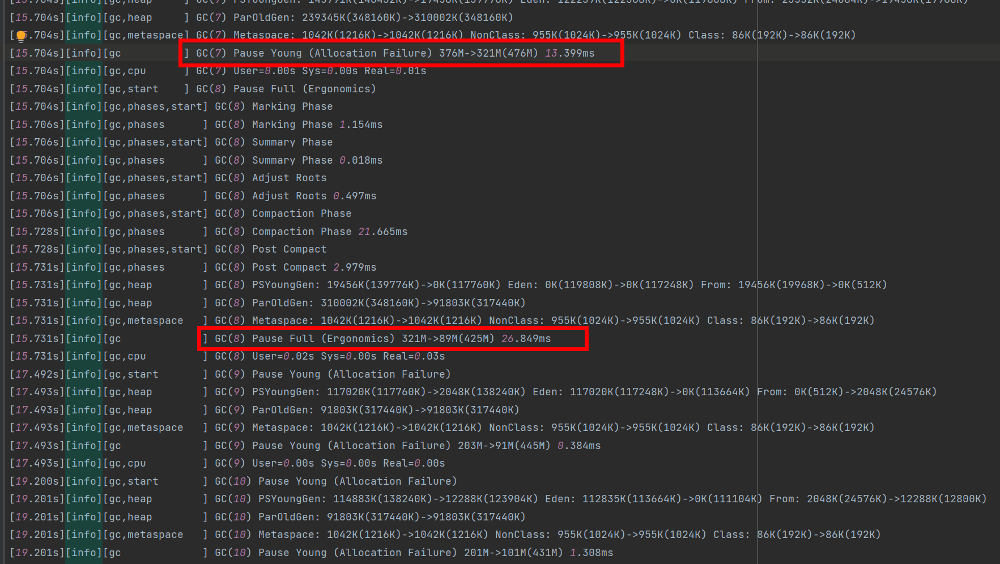

**分析**：

- **Full GC暂停时间显著增加**(11.350ms --> 26.849ms)，说明在增加线程数后，Full GC阶段的某些操作时间变长。
- 年轻代GC暂停时间从：2.728ms - 9.136ms  ——>  0.384ms - 15.279ms，最大值增加也有可能是线程数增加引起的调度开销。

#### 4.1.2 **JVM修改参数：ParallelGCThreads=8**

Java命令：

```java
-XX:+UseParallelGC
-XX:ParallelGCThreads=8
-Xlog:gc*:file=gc.log
```

日志位置：[CPUs12Use8.log](./gclogs/CPUs12Use8.log)

实际效果：

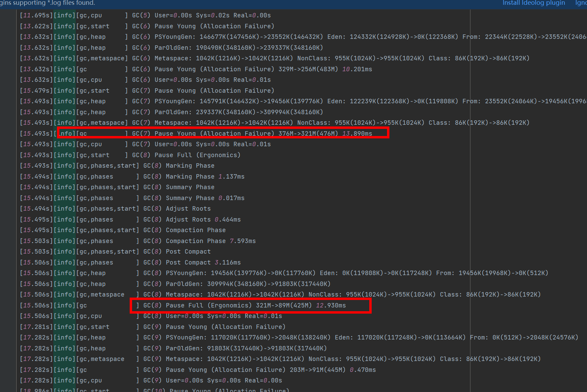

**分析**：

- **Full GC暂停时间略微增加**(11.350ms --> 12.930ms)，表明减少线程数对Full GC的效率有一定影响，但并不显著。
- 年轻代GC暂停时间从：2.728ms - 9.136ms  -->  0.470ms - 15.477ms，最大值增加可能是线程数减少导致的GC任务处理时间变长。

#### 4.1.3 **JVM修改参数：ParallelGCThreads=5**

Java命令：

```java
-XX:+UseParallelGC
-XX:ParallelGCThreads=5
-Xlog:gc*:file=gc.log
```

日志位置：[CPUs12Use5.log](./gclogs/CPUs12Use5.log)

实际效果：

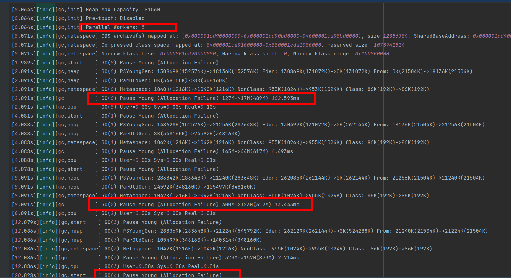

**分析**：

- 初始（warmup）阶段的第一次GC暂停时间较长（102.593ms）。
- 年轻代GC暂停时间大部分维持在6.493ms - 13.443ms。
- 没有触发Full GC

#### 4.1.4 思考总结

**12线程设置**：加线程数并没有显著优化年轻代GC的暂停时间，相反，还出现了较大的暂停时间波动。Full GC暂停时间明显增加，表明增加线程数在Full GC阶段的效率下降。

**8线程设置**：根据观察结果，减少线程数对年轻代GC的暂停时间有负面影响，虽然对Full GC影响不大。

**5线程设置**：在某些情况下减少了GC频率，但GC暂停时间波动较大，可能影响系统的稳定性和响应时间。并且，在增加程序运行时常后（1500iter - 4500iter）后，5线程GC次数和时长大于10线程的GC时长。

**结论**：后续保持**Parallel GC线程数为初始值10**，调优其他参数。

### 4.2 堆内存

因为堆内存增加，程序运行时间过短，无法进行有效记录，因此增加程序运行时常后（1500iter - 4500iter）代码如下：

```java
import java.util.ArrayList;
import java.util.List;

public class ParallelGCTest {
    public static void main(String[] args) {
        List<byte[]> list = new ArrayList<>();  // ArrayList存储数组
        int counter = 0;                        // 初始化计数器
        int maxIterations = 4500;               // 设置最大迭代次数，避免无限运行
        while (counter < maxIterations) {
            // 每次迭代时向list添加1MB
            list.add(new byte[1024 * 1024]);
            if (++counter % 100 == 0) {
                list.clear();
                System.out.println("Iteration: " + counter + " - Cleared list to trigger GC");
            }
            try {
                // 每次迭代后线程休眠10ms
                Thread.sleep(10);
            } catch (InterruptedException e) {
                // 处理中断异常，并恢复线程的中断状态
                Thread.currentThread().interrupt();
                break;
            }
        }
        System.out.println("Test completed");
    }
}
```

#### 4.2.1 JVM初始参数（未改动）：-Xms510M

Java命令：

```java
-XX:+UseParallelGC
-XX:ParallelGCThreads=10
-Xlog:gc*:file=gc.log
```

日志位置：[Heap510mb_4500iter.log](./gclogs/Heap510mb_4500iter.log)

实际效果：

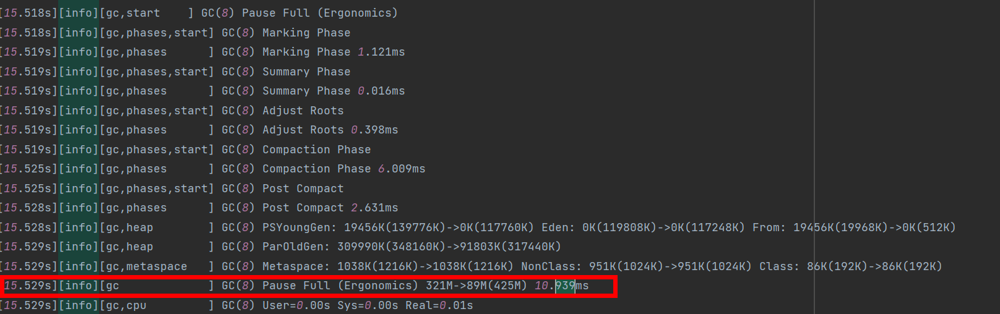

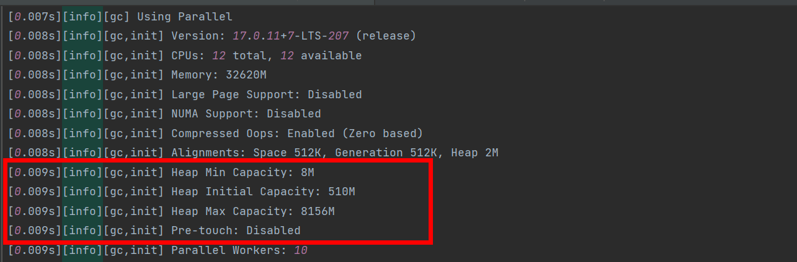

**分析**：

- 吞吐量：99.495%。
- Allocation Failure次数63次 + Full GC 5次
- 最大GC时间：10.939 ms。
- 平均GC时间：5.22 ms，
- 总GC时间（Allocation Failure+Full GC）：355 ms
- GC所花CPU的时间：150 ms

#### 4.2.2 JVM初始参数：-Xms1G

Java命令：

```java
-XX:+UseParallelGC
-XX:ParallelGCThreads=10
-Xms1024M
-Xlog:gc*:file=gc.log
```

日志位置：[Heap1G_4500iter.log](./gclogs/Heap1G_4500iter.log)

实际效果：

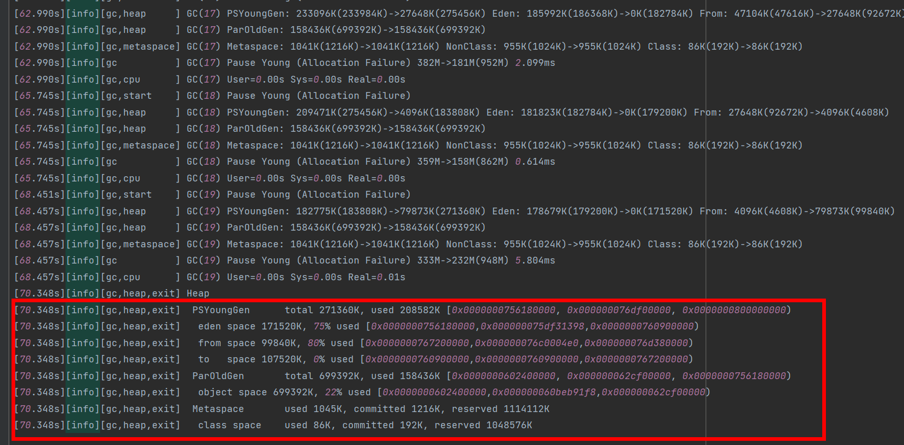

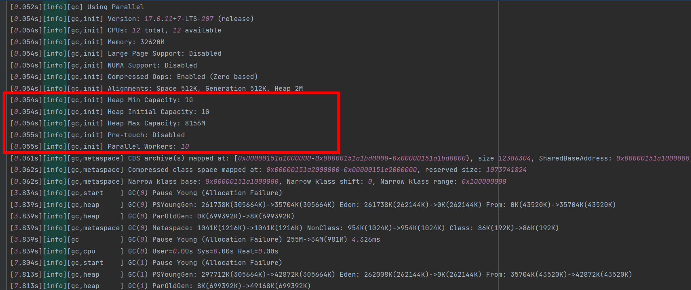

**分析**：

- 吞吐量：99.842%
- Allocation Failure次数20次
- 最大GC时间：8.871ms
- 平均GC时间：5.57 ms
- 总GC时间（Allocation Failure+Full GC）：111 ms
- GC所花CPU的时间：非常低，总体对CPU影响不大

#### 4.2.3 JVM初始参数：-Xms2G / -Xms4G / -Xms8G

Java主命令：

```java
-XX:+UseParallelGC
-XX:ParallelGCThreads=10
-Xlog:gc*:file=gc.log
```

Java修改命令：

```java
-Xms2G
-Xms4G
-Xms8G
```

日志位置：[Heap2G_4500iter.log](./gclogs/Heap2G_4500iter.log)、[Heap4G_4500iter.log](./gclogs/Heap4G_4500iter.log)、[Heap8G_4500iter.log](./gclogs/Heap8G_4500iter.log)

实际效果：

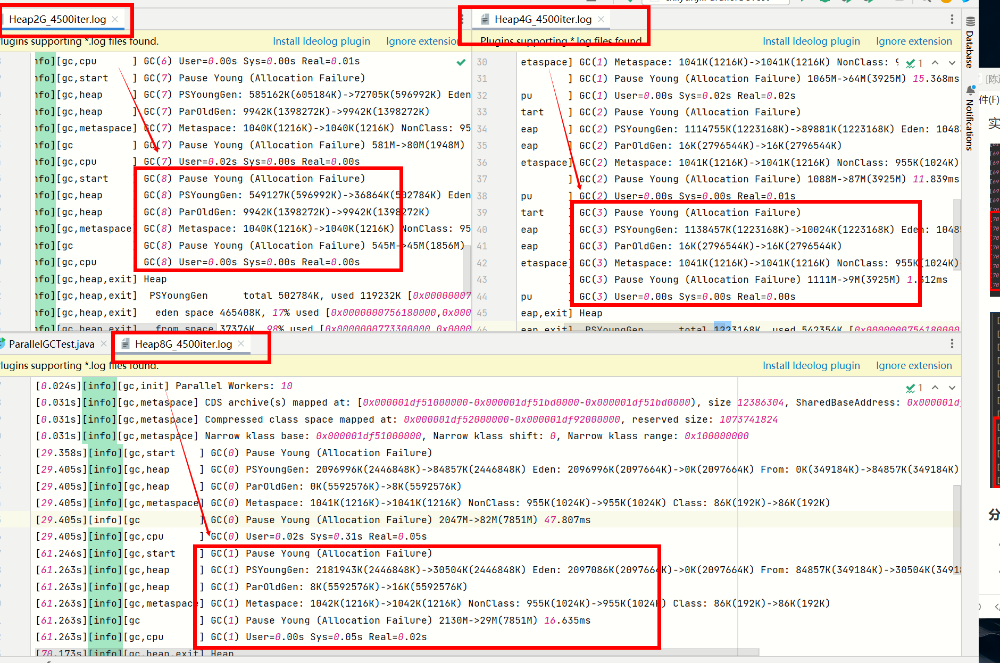

**分析**：

|                                        | Heap2G_4500iter | Heap4G_4500iter | Heap8G_4500iter |
| -------------------------------------- | --------------- | --------------- | --------------- |
| 吞吐量                                 | 99.926%         | 99.927%         | 99.9%           |
| Allocation Failure次数                 | 9               | 4               | 2               |
| 最大GC时间                             | 8.060ms         | *24*.176ms      | *47*.807ms      |
| 平均GC时间                             | 5.74 ms         | 12.8 ms         | 35.0 ms         |
| 总GC时间（Allocation Failure+Full GC） | 51.7 ms         | 51.3ms          | 70.0 ms         |
| GC所花CPU的时间                        | 非常低          | 140 ms          | 380ms           |

#### 4.2.4 思考总结

**吞吐量：4GB > 2GB > 8GB > 1GB > 510MB**：较大的初始堆内存减少了GC频率，增加了应用程序在不进行GC时执行有用工作的时间，从而提高了吞吐量。而太大的初始内存

**GC频率（次数）：8GB < 4GB < 2GB < 1GB < 510MB**： 初始堆内存为8GB时，GC频率最低，减少了应用程序的打断次数。

**总GC时间：4GB < 2GB < 8GB < 1GB < 510MB**：初始堆内存为4GB时，因为平均GC时间最少 + GC次数为主要原因，GC总时间最少。

**最大GC时间：2GB < 1GB < 510MB < 4GB < 8GB**：初始堆内存为2GB时，最大GC时间最小。4G和8G最大GC时间多的原因，是初始GC（warmup阶段）花费时间较多。

**平均GC时间：510MB < 1GB < 2GB < 4GB < 8GB** ：初始堆内存为510MB时，平均GC时间最短。但更高的GC频率可能抵消其优势。

**GC所花CPU的时间：1GB = 2GB < 4GB < 510MB < 8GB**：1G和2G很低，对CPU影响不大。

**总结**：

- 4GB和8GB在GC次数上面有很大优势，但是却反而花费更多的GC时间，并且有一定量的CPU时间花费，导致吞吐量反而下降，因此后续要重点考核。

- 后续将初始堆内存设置为 **2、4、8GB**，研究其年轻代和老年代的内存比例大小，希望以**提高吞吐量和减少GC频率**。
- 程序上后续已经做过初步2、3个实验，但是已经**发现年轻代GC触发频率很高**，因此，后续需要改一下程序，期望模拟更大、更随机的内存模拟环境，减少年轻代的频发并增加Full GC次数。


## 五、调优：代码重制版

代码重置原因：之前代码没有控制对象的存活时间，同时对象创建（内存消耗）速率和清除对象速率没有得到控制，因此需要先从程序方面，控制这些问题，最后再配合jvm参数调整。

通过代码重置后，对象创建速度从原本代码的1G/s降到了130mb/s，晋升速度也从100mb/s下降到了6mb/s。

同时因为当堆内存大于2G的时候，相比于133.41 M/s的对象创建速度，过于的大。所以会发现Full GC次数在200s内很难观测到（仅1次），因此我们不再进行大于4G的展示，仅在512m，1G，2G中进行JVM参数调优

代码如下：
<details>
    <summary>点击展开/折叠程序</summary>

```java
import java.util.ArrayList;
import java.util.LinkedList;
import java.util.List;
import java.util.Queue;

public class ParallelGCTest {
    private static final int MAX_POOL_SIZE = 1000; // 最大对象池大小
    private static final Queue<byte[]> OBJECT_POOL = new LinkedList<>(); // 对象池

    public static void main(String[] args) {
        List<byte[]> list = new ArrayList<>(); // ArrayList存储数组
        List<byte[]> longerLivedList = new ArrayList<>(); // 存放长时间存活的对象
        int counter = 0; // 初始化计数器
        int maxIterations = 2000; // 设置最大迭代次数，避免无限运行
        int[] martx = new int[]{1, 1, 5, 5, 5, 5, 5, 5, 10, 10, 20, 50, 100};
        int j = 0;
        int longerLivedThreshold = 7; // 定义一个阈值，使部分对象存活更长时间

        while (counter < maxIterations) {
            byte[] array = getObjectFromPool(); // 从对象池获取对象
            if (array == null) {
                array = new byte[martx[j] * 1024 * 1024]; // 如果对象池为空，分配新对象
            }
            counter++;
            list.add(array);
            if (counter % longerLivedThreshold == 0) {
                longerLivedList.add(array);
            }

            j = (j + 1) % martx.length;
            list.subList(0, list.size() / 2).clear();
            System.out.println("Iteration: " + counter + " - Cleared list to trigger GC");

            if (counter % (longerLivedThreshold * 5) == 0) {
                recycleObjects(longerLivedList); // 回收长时间存活的对象到对象池
                System.out.println("Cleared longerLivedList to simulate longer-lived object processing");
            }

            try {
                Thread.sleep(100); // 每次迭代后线程休眠100ms
            } catch (InterruptedException e) {
                Thread.currentThread().interrupt();
                break;
            }
        }
        System.out.println("Test completed");
    }

    private static byte[] getObjectFromPool() {
        return OBJECT_POOL.poll(); // 从对象池获取对象
    }

    private static void recycleObjects(List<byte[]> objects) {
        if (OBJECT_POOL.size() < MAX_POOL_SIZE) {
            OBJECT_POOL.addAll(objects); // 将对象添加回对象池
        }
        objects.clear(); // 清空列表
    }
}
```
</details>


### 5.1 堆内存512m

#### 5.1.1  Parallel GC线程-512m

**JVM修改参数：-XX:ParallelGCThreads=n**

此实验，初步从线程数量为切入点，主要观察512m，1G在不同线程数量上，重要参数是否有大的改变。

因为线程数量不是越多越好，结合本次实验的物理环境，将重点观察2，4，6(物理核心数量)，8，12（逻辑处理器数量）

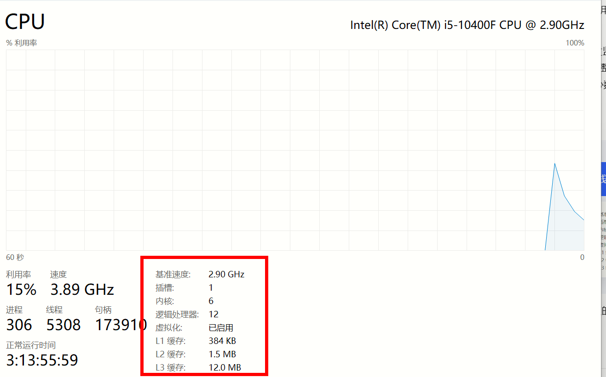

**参数设置**：Java 8

```
-XX:+UseParallelGC
-Xms512m
-Xmx512m
-Xloggc:gc.log
-XX:+PrintGCDetails
```

-XX:ParallelGCThreads=2、4、6、8、10、12

**分析日志**：

1. 随着线程数量增加，GC吞吐量进行轻微上升
2. 随着线程数量增加，GC总暂停时间，基本增加，只有线程数=12时进行再度下降，但因为总时间也有波动，因此仍然按照GC吞吐量为准
3. 随着线程数量增加，年轻代GC次数有不同程度下降，线程数=6时次数最少
4. 随着线程数量增加，老年代GC次数轻微上升

**总结**：线程数=2 时，GC吞吐量是最佳，并且因为尽量避免老年代GC的产生，也是Full GC最少的情况，其中线程数=6时，因为Young GC次数下降明显，也会作为后续的一个考虑。因此，选择线程等于6进行后续调优

**日志位置**：
<details>
    <summary>点击展开/折叠</summary>

[ParallelGCThreads2_Xmx512m_Xms512m.log](./gclogs/ParallelGCThreads2_Xmx512m_Xms512m.log)

[ParallelGCThreads4_Xmx512m_Xms512m.log](./gclogs/ParallelGCThreads4_Xmx512m_Xms512m.log)

[ParallelGCThreads6_Xmx512m_Xms512m.log](./gclogs/ParallelGCThreads6_Xmx512m_Xms512m.log)

[ParallelGCThreads8_Xmx512m_Xms512m.log](./gclogs/ParallelGCThreads8_Xmx512m_Xms512m.log)

[ParallelGCThreads10_Xmx512m_Xms512m.log](./gclogs/ParallelGCThreads10_Xmx512m_Xms512m.log)

[ParallelGCThreads12_Xmx512m_Xms512m.log](./gclogs/ParallelGCThreads12_Xmx512m_Xms512m.log)

</details>


**图片分析**：

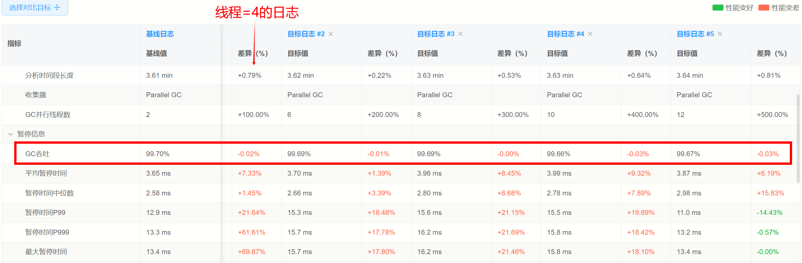

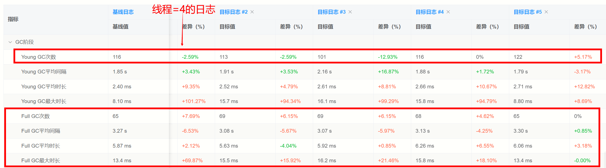


#### 5.1.2  NewRatio年轻代与老年代比例-512m6线程

**JVM修改参数：-NewRatio=n**

本参数改动，基于堆内存512mb、6线程数进行设置

**参数设置**：Java 8

```
-XX:+UseParallelGC
-XX:ParallelGCThreads=6
-Xms512m
-Xmx512m
-Xloggc:gc.log
-XX:+PrintGCDetails
```

-XX:NewRatio=1、2、3、4、5、6、7、8、9

**分析日志**：

1. 随着NewRatio=1增加，GC吞吐量呈现先下降（NewRatio3-6）再上升（NewRatio7-9）到近基准的趋势
2. 随着NewRatio=1增加，Yong GC次数先增加再略微下降趋势
3. 随着NewRatio=1增加，Old GC次数先增加再略微下降趋势

**总结**：

1. NewRatio=1 时，GC吞吐量是最佳，并且因为尽量避免老年代GC的产生，NewRatio=1、2也是Young GC和Full GC最少的情况。
2. GC数量虽然会随着Old 区域的增加大量增加，但是吞吐量却在NewRatio=7、8、9的时候进行恢复到NewRatio=1附近

**综上，我们将关注NewRatio=1、2、7、8、9在年轻代中Eden区与Survivor区的比例**


**日志位置**：

<details>
    <summary>点击展开/折叠</summary>

[ParallelGCThreads6_Xmx512m_Xms512m_NewRatio1.log](./gclogs/ParallelGCThreads6_Xmx512m_Xms512m_NewRatio1.log)

[ParallelGCThreads6_Xmx512m_Xms512m_NewRatio2.log](./gclogs/ParallelGCThreads6_Xmx512m_Xms512m_NewRatio2.log)

[ParallelGCThreads6_Xmx512m_Xms512m_NewRatio3.log](./gclogs/ParallelGCThreads6_Xmx512m_Xms512m_NewRatio3.log)

[ParallelGCThreads6_Xmx512m_Xms512m_NewRatio4.log](./gclogs/ParallelGCThreads6_Xmx512m_Xms512m_NewRatio4.log)

[ParallelGCThreads6_Xmx512m_Xms512m_NewRatio5.log](./gclogs/ParallelGCThreads6_Xmx512m_Xms512m_NewRatio5.log)

[ParallelGCThreads6_Xmx512m_Xms512m_NewRatio6.log](./gclogs/ParallelGCThreads6_Xmx512m_Xms512m_NewRatio6.log)

[ParallelGCThreads6_Xmx512m_Xms512m_NewRatio7.log](./gclogs/ParallelGCThreads6_Xmx512m_Xms512m_NewRatio7.log)

[ParallelGCThreads6_Xmx512m_Xms512m_NewRatio8.log](./gclogs/ParallelGCThreads6_Xmx512m_Xms512m_NewRatio8.log)

[ParallelGCThreads6_Xmx512m_Xms512m_NewRatio9.log](./gclogs/ParallelGCThreads6_Xmx512m_Xms512m_NewRatio9.log)

</detail>

**图片分析**：基准NewRatio=9

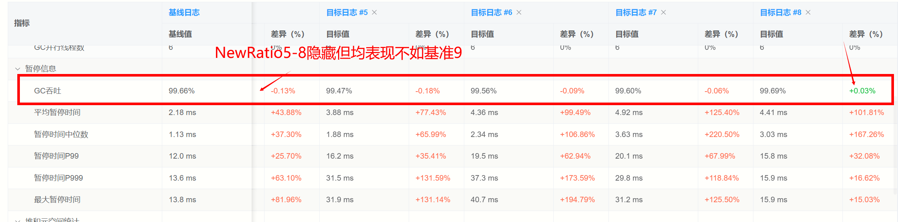

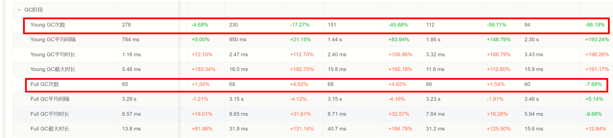

#### 5.1.3  Eden:SurvivorRatio

**JVM修改参数：-new_ratio=n, -XX:SurvivorRatio=n**

本参数改动，基于**堆内存512mb、6线程数**进行设置.

new_ratio = [1, 2, 7, 8, 9]

survivor_ratio = [1, 2, 3, 4, 5, 6, 7, 8, 9, 10, 11, 12, 13]

**参数设置**：Java 8

```
-XX:+UseParallelGC
-XX:ParallelGCThreads=6
-Xms512m
-Xmx512m
-Xloggc:gc.log
-XX:+PrintGCDetails
```

-XX:NewRatio=[1, 2, 7, 8, 9]

-XX:SurvivorRatio= [1, 2, 3, 4, 5, 6, 7, 8, 9, 10, 11, 12, 13]

**分析日志**：

1. 当NewRatio=1时，随着SurvivorRatio的增加，整体吞吐量都没有大的波动（1%），GC次数，基本没有大的波动，10%以内，极个别超出50%（SurRatio9-13），但是吞吐量差距不大（0.1%~）。**最佳表现：NewRatio=1 + SurvivorRatio=4  --> GC吞吐：99.72%**
2. 当NewRatio=2（jvm默认参数）时，随着SurvivorRatio的增加，即Eden内存的增加，GC吞吐量，呈现上升趋势，最大值在SurvivorRatio=5,6出现。Young GC和Full GC次数，均在此时达到平衡（YoungGC适量增加，Full GC适量减少）。**最佳表现：NewRatio=2 + SurvivorRatio=5/6  --> GC吞吐：99.73%**
3. 当NewRatio=7时，随着SurvivorRatio的增加，整体吞吐量都没有大的波动（0.05%），Young GC次数逐渐减少（296 --> 221），但是Full GC次数不变（**65**）**最佳表现：NewRatio=7 + SurvivorRatio=10-13  --> GC吞吐：99.67%**
4. 当NewRatio=8时，随着SurvivorRatio的增加，整体吞吐量都没有大的波动（0.05%），Young GC次数逐渐减少（362 --> 251），但是Full GC次数不变（**65**）**最佳表现：NewRatio=8 + SurvivorRatio=10-13  --> GC吞吐：99.70%**
5. 当NewRatio=9时，随着SurvivorRatio的增加，整体吞吐量都没有大的波动（0.05%），Young GC次数先上升再下降最后再上升（最低278 -> 254），但是Full GC次数不变（**65**）**最佳表现：NewRatio=9 + SurvivorRatio=7  --> GC吞吐：99.67%**


**日志位置**：

<details>
    <summary>点击展开/折叠</summary>
[ParallelGCThreads6_Xmx512m_Xms512m_NewRatio1_SurRatio1.log](./gclogs/ParallelGCThreads6_Xmx512m_Xms512m_NewRatio1_SurRatio1.log)

[ParallelGCThreads6_Xmx512m_Xms512m_NewRatio1_SurRatio2.log](./gclogs/ParallelGCThreads6_Xmx512m_Xms512m_NewRatio1_SurRatio12.log)

[ParallelGCThreads6_Xmx512m_Xms512m_NewRatio1_SurRatio3.log](./gclogs/ParallelGCThreads6_Xmx512m_Xms512m_NewRatio1_SurRatio3.log)

[ParallelGCThreads6_Xmx512m_Xms512m_NewRatio1_SurRatio4.log](./gclogs/ParallelGCThreads6_Xmx512m_Xms512m_NewRatio1_SurRatio4.log)

[ParallelGCThreads6_Xmx512m_Xms512m_NewRatio1_SurRatio5.log](./gclogs/ParallelGCThreads6_Xmx512m_Xms512m_NewRatio1_SurRatio5.log)

[ParallelGCThreads6_Xmx512m_Xms512m_NewRatio1_SurRatio6.log](./gclogs/ParallelGCThreads6_Xmx512m_Xms512m_NewRatio1_SurRatio6.log)

[ParallelGCThreads6_Xmx512m_Xms512m_NewRatio1_SurRatio7.log](./gclogs/ParallelGCThreads6_Xmx512m_Xms512m_NewRatio1_SurRatio7.log)

[ParallelGCThreads6_Xmx512m_Xms512m_NewRatio1_SurRatio8.log](./gclogs/ParallelGCThreads6_Xmx512m_Xms512m_NewRatio1_SurRatio8.log)

[ParallelGCThreads6_Xmx512m_Xms512m_NewRatio1_SurRatio9.log](./gclogs/ParallelGCThreads6_Xmx512m_Xms512m_NewRatio1_SurRatio9.log)

[ParallelGCThreads6_Xmx512m_Xms512m_NewRatio1_SurRatio10.log](./gclogs/ParallelGCThreads6_Xmx512m_Xms512m_NewRatio1_SurRatio10.log)

[ParallelGCThreads6_Xmx512m_Xms512m_NewRatio1_SurRatio11.log](./gclogs/ParallelGCThreads6_Xmx512m_Xms512m_NewRatio1_SurRatio11.log)

[ParallelGCThreads6_Xmx512m_Xms512m_NewRatio1_SurRatio12.log](./gclogs/ParallelGCThreads6_Xmx512m_Xms512m_NewRatio1_SurRatio12.log)

[ParallelGCThreads6_Xmx512m_Xms512m_NewRatio1_SurRatio13.log](./gclogs/ParallelGCThreads6_Xmx512m_Xms512m_NewRatio1_SurRatio13.log)

[ParallelGCThreads6_Xmx512m_Xms512m_NewRatio2_SurRatio1.log](./gclogs/ParallelGCThreads6_Xmx512m_Xms512m_NewRatio2_SurRatio1.log)

[ParallelGCThreads6_Xmx512m_Xms512m_NewRatio2_SurRatio2.log](./gclogs/ParallelGCThreads6_Xmx512m_Xms512m_NewRatio2_SurRatio12.log)

[ParallelGCThreads6_Xmx512m_Xms512m_NewRatio2_SurRatio3.log](./gclogs/ParallelGCThreads6_Xmx512m_Xms512m_NewRatio2_SurRatio3.log)

[ParallelGCThreads6_Xmx512m_Xms512m_NewRatio2_SurRatio4.log](./gclogs/ParallelGCThreads6_Xmx512m_Xms512m_NewRatio2_SurRatio4.log)

[ParallelGCThreads6_Xmx512m_Xms512m_NewRatio2_SurRatio5.log](./gclogs/ParallelGCThreads6_Xmx512m_Xms512m_NewRatio1_SurRatio5.log)

[ParallelGCThreads6_Xmx512m_Xms512m_NewRatio2_SurRatio6.log](./gclogs/ParallelGCThreads6_Xmx512m_Xms512m_NewRatio2_SurRatio6.log)

[ParallelGCThreads6_Xmx512m_Xms512m_NewRatio2_SurRatio7.log](./gclogs/ParallelGCThreads6_Xmx512m_Xms512m_NewRatio2_SurRatio7.log)

[ParallelGCThreads6_Xmx512m_Xms512m_NewRatio2_SurRatio8.log](./gclogs/ParallelGCThreads6_Xmx512m_Xms512m_NewRatio2_SurRatio8.log)

[ParallelGCThreads6_Xmx512m_Xms512m_NewRatio2_SurRatio9.log](./gclogs/ParallelGCThreads6_Xmx512m_Xms512m_NewRatio2_SurRatio9.log)

[ParallelGCThreads6_Xmx512m_Xms512m_NewRatio2_SurRatio10.log](./gclogs/ParallelGCThreads6_Xmx512m_Xms512m_NewRatio2_SurRatio10.log)

[ParallelGCThreads6_Xmx512m_Xms512m_NewRatio2_SurRatio11.log](./gclogs/ParallelGCThreads6_Xmx512m_Xms512m_NewRatio2_SurRatio11.log)

[ParallelGCThreads6_Xmx512m_Xms512m_NewRatio2_SurRatio12.log](./gclogs/ParallelGCThreads6_Xmx512m_Xms512m_NewRatio2_SurRatio12.log)

[ParallelGCThreads6_Xmx512m_Xms512m_NewRatio2_SurRatio13.log](./gclogs/ParallelGCThreads6_Xmx512m_Xms512m_NewRatio2_SurRatio13.log)

[ParallelGCThreads6_Xmx512m_Xms512m_NewRatio7_SurRatio1.log](./gclogs/ParallelGCThreads6_Xmx512m_Xms512m_NewRatio7_SurRatio1.log)

[ParallelGCThreads6_Xmx512m_Xms512m_NewRatio7_SurRatio2.log](./gclogs/ParallelGCThreads6_Xmx512m_Xms512m_NewRatio7_SurRatio12.log)

[ParallelGCThreads6_Xmx512m_Xms512m_NewRatio7_SurRatio3.log](./gclogs/ParallelGCThreads6_Xmx512m_Xms512m_NewRatio7_SurRatio3.log)

[ParallelGCThreads6_Xmx512m_Xms512m_NewRatio7_SurRatio4.log](./gclogs/ParallelGCThreads6_Xmx512m_Xms512m_NewRatio7_SurRatio4.log)

[ParallelGCThreads6_Xmx512m_Xms512m_NewRatio7_SurRatio5.log](./gclogs/ParallelGCThreads6_Xmx512m_Xms512m_NewRatio7_SurRatio5.log)

[ParallelGCThreads6_Xmx512m_Xms512m_NewRatio7_SurRatio6.log](./gclogs/ParallelGCThreads6_Xmx512m_Xms512m_NewRatio7_SurRatio6.log)

[ParallelGCThreads6_Xmx512m_Xms512m_NewRatio7_SurRatio7.log](./gclogs/ParallelGCThreads6_Xmx512m_Xms512m_NewRatio7_SurRatio7.log)

[ParallelGCThreads6_Xmx512m_Xms512m_NewRatio7_SurRatio8.log](./gclogs/ParallelGCThreads6_Xmx512m_Xms512m_NewRatio7_SurRatio8.log)

[ParallelGCThreads6_Xmx512m_Xms512m_NewRatio7_SurRatio9.log](./gclogs/ParallelGCThreads6_Xmx512m_Xms512m_NewRatio7_SurRatio9.log)

[ParallelGCThreads6_Xmx512m_Xms512m_NewRatio7_SurRatio10.log](./gclogs/ParallelGCThreads6_Xmx512m_Xms512m_NewRatio7_SurRatio10.log)

[ParallelGCThreads6_Xmx512m_Xms512m_NewRatio7_SurRatio11.log](./gclogs/ParallelGCThreads6_Xmx512m_Xms512m_NewRatio7_SurRatio11.log)

[ParallelGCThreads6_Xmx512m_Xms512m_NewRatio7_SurRatio12.log](./gclogs/ParallelGCThreads6_Xmx512m_Xms512m_NewRatio2_SurRatio12.log)

[ParallelGCThreads6_Xmx512m_Xms512m_NewRatio7_SurRatio13.log](./gclogs/ParallelGCThreads6_Xmx512m_Xms512m_NewRatio2_SurRatio13.log)

[ParallelGCThreads6_Xmx512m_Xms512m_NewRatio8_SurRatio1.log](./gclogs/ParallelGCThreads6_Xmx512m_Xms512m_NewRatio8_SurRatio1.log)

[ParallelGCThreads6_Xmx512m_Xms512m_NewRatio8_SurRatio2.log](./gclogs/ParallelGCThreads6_Xmx512m_Xms512m_NewRatio8_SurRatio12.log)

[ParallelGCThreads6_Xmx512m_Xms512m_NewRatio8_SurRatio3.log](./gclogs/ParallelGCThreads6_Xmx512m_Xms512m_NewRatio8_SurRatio3.log)

[ParallelGCThreads6_Xmx512m_Xms512m_NewRatio8_SurRatio4.log](./gclogs/ParallelGCThreads6_Xmx512m_Xms512m_NewRatio8_SurRatio4.log)

[ParallelGCThreads6_Xmx512m_Xms512m_NewRatio8_SurRatio5.log](./gclogs/ParallelGCThreads6_Xmx512m_Xms512m_NewRatio8_SurRatio5.log)

[ParallelGCThreads6_Xmx512m_Xms512m_NewRatio8_SurRatio6.log](./gclogs/ParallelGCThreads6_Xmx512m_Xms512m_NewRatio8_SurRatio6.log)

[ParallelGCThreads6_Xmx512m_Xms512m_NewRatio8_SurRatio7.log](./gclogs/ParallelGCThreads6_Xmx512m_Xms512m_NewRatio8_SurRatio7.log)

[ParallelGCThreads6_Xmx512m_Xms512m_NewRatio8_SurRatio8.log](./gclogs/ParallelGCThreads6_Xmx512m_Xms512m_NewRatio8_SurRatio8.log)

[ParallelGCThreads6_Xmx512m_Xms512m_NewRatio8_SurRatio9.log](./gclogs/ParallelGCThreads6_Xmx512m_Xms512m_NewRatio8_SurRatio9.log)

[ParallelGCThreads6_Xmx512m_Xms512m_NewRatio8_SurRatio10.log](./gclogs/ParallelGCThreads6_Xmx512m_Xms512m_NewRatio8_SurRatio10.log)

[ParallelGCThreads6_Xmx512m_Xms512m_NewRatio8_SurRatio11.log](./gclogs/ParallelGCThreads6_Xmx512m_Xms512m_NewRatio8_SurRatio11.log)

[ParallelGCThreads6_Xmx512m_Xms512m_NewRatio8_SurRatio12.log](./gclogs/ParallelGCThreads6_Xmx512m_Xms512m_NewRatio8_SurRatio12.log)

[ParallelGCThreads6_Xmx512m_Xms512m_NewRatio8_SurRatio13.log](./gclogs/ParallelGCThreads6_Xmx512m_Xms512m_NewRatio9_SurRatio13.log)

[ParallelGCThreads6_Xmx512m_Xms512m_NewRatio9_SurRatio1.log](./gclogs/ParallelGCThreads6_Xmx512m_Xms512m_NewRatio8_SurRatio1.log)

[ParallelGCThreads6_Xmx512m_Xms512m_NewRatio9_SurRatio2.log](./gclogs/ParallelGCThreads6_Xmx512m_Xms512m_NewRatio9_SurRatio12.log)

[ParallelGCThreads6_Xmx512m_Xms512m_NewRatio9_SurRatio3.log](./gclogs/ParallelGCThreads6_Xmx512m_Xms512m_NewRatio9_SurRatio3.log)

[ParallelGCThreads6_Xmx512m_Xms512m_NewRatio9_SurRatio4.log](./gclogs/ParallelGCThreads6_Xmx512m_Xms512m_NewRatio9_SurRatio4.log)

[ParallelGCThreads6_Xmx512m_Xms512m_NewRatio9_SurRatio5.log](./gclogs/ParallelGCThreads6_Xmx512m_Xms512m_NewRatio9_SurRatio5.log)

[ParallelGCThreads6_Xmx512m_Xms512m_NewRatio9_SurRatio6.log](./gclogs/ParallelGCThreads6_Xmx512m_Xms512m_NewRatio9_SurRatio6.log)

[ParallelGCThreads6_Xmx512m_Xms512m_NewRatio9_SurRatio7.log](./gclogs/ParallelGCThreads6_Xmx512m_Xms512m_NewRatio9_SurRatio7.log)

[ParallelGCThreads6_Xmx512m_Xms512m_NewRatio9_SurRatio8.log](./gclogs/ParallelGCThreads6_Xmx512m_Xms512m_NewRatio9_SurRatio8.log)

[ParallelGCThreads6_Xmx512m_Xms512m_NewRatio9_SurRatio9.log](./gclogs/ParallelGCThreads6_Xmx512m_Xms512m_NewRatio9_SurRatio9.log)

[ParallelGCThreads6_Xmx512m_Xms512m_NewRatio9_SurRatio10.log](./gclogs/ParallelGCThreads6_Xmx512m_Xms512m_NewRatio9_SurRatio10.log)

[ParallelGCThreads6_Xmx512m_Xms512m_NewRatio9_SurRatio11.log](./gclogs/ParallelGCThreads6_Xmx512m_Xms512m_NewRatio9_SurRatio11.log)

[ParallelGCThreads6_Xmx512m_Xms512m_NewRatio9_SurRatio12.log](./gclogs/ParallelGCThreads6_Xmx512m_Xms512m_NewRatio9_SurRatio12.log)

[ParallelGCThreads6_Xmx512m_Xms512m_NewRatio9_SurRatio13.log](./gclogs/ParallelGCThreads6_Xmx512m_Xms512m_NewRatio9_SurRatio13.log)

</detail>

**图片分析**：基准ParallelGCThreads6_Xmx512m_Xms512m_NewRatio1/2/7/8/9

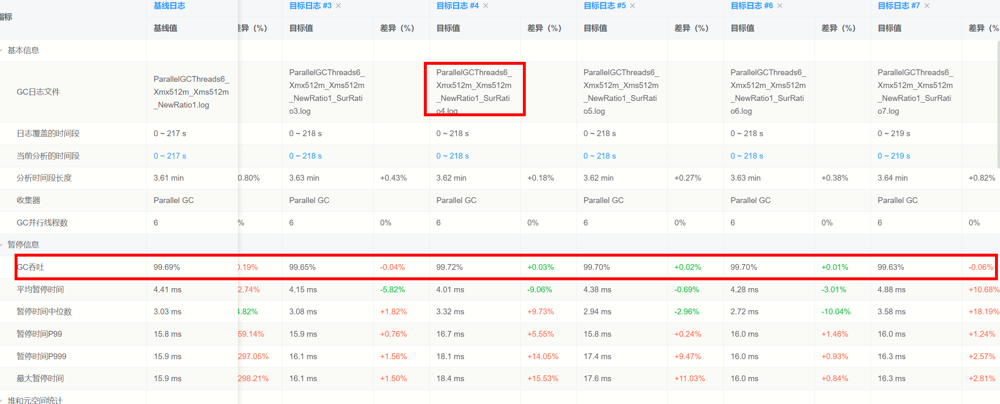

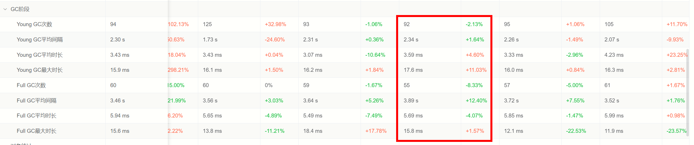

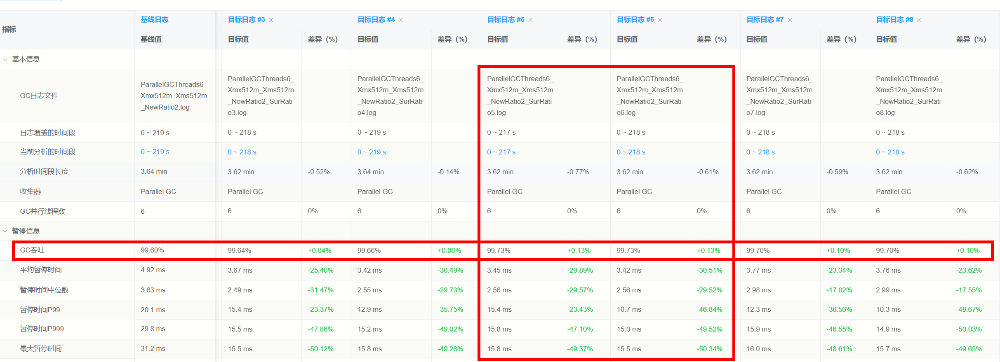

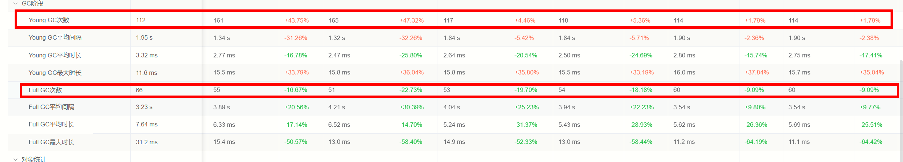

#### 总结：

1. 当NewRatio=1-2时，代表年轻代区域大，Eden区域变动大；因此，NewRatio=2（jvm默认参数）时，主要的Full GC次数相对减少，因此导致GC吞吐量时最大的
2. 当NewRatio=7-9时，代表年轻代区域小，Eden区域比例变动实际内存变动小。也就是**老年代区域大，这也是为什么Full GC次数不发生改变的原因**。但因为Young GC次数过大（即使年轻代区域小，每次GC时间短）导致吞吐量无法上升。只有依靠，增加Eden区域来减少Young GC次数，但仍然不能达到jvm参数最优

**综上：**当内存为512m时，NewRatio=2（jvm默认参数） + SurvivorRatio=5/6  --> 


### 5.2 堆内存大小为1G

#### 5.2.1 Parallel GC线程-1G

分析日志：

1. 随着线程数量增加，GC吞吐量进行轻微下降，GC总暂停时间，基本下降（总时间基本不变）
2. 随着线程数量增加，年轻代GC次数，老年代GC次数均未发生太多变动（浮动<3%）

**总结**：线程数=6，8 时，GC吞吐量是最佳，并且因为尽量避免老年代GC的产生，也是Full GC最少（相比线程数=2不变）的情况。因为线程数=6，8的时候，GC次数不变，GC时间下降，虽然ms级别对于200s的工作时间影响较小，但是也是主要的提升原因，GC吞吐量上涨0.02%和0.03%

**日志位置**：

[ParallelGCThreads2_Xmx1G_Xms1G](./gclogs/ParallelGCThreads2_Xmx1G_Xms1G.log)

[ParallelGCThreads4_Xmx1G_Xms1G](./gclogs/ParallelGCThreads4_Xmx1G_Xms1G.log)

[ParallelGCThreads6_Xmx1G_Xms1G](./gclogs/ParallelGCThreads6_Xmx1G_Xms1G.log)

[ParallelGCThreads8_Xmx1G_Xms1G](./gclogs/ParallelGCThreads8_Xmx1G_Xms1G.log)

[ParallelGCThreads10_Xmx1G_Xms1G](./gclogs/ParallelGCThreads10_Xmx1G_Xms1G.log)

[ParallelGCThreads12_Xmx1G_Xms1G](./gclogs/ParallelGCThreads12_Xmx1G_Xms1G.log)

**图片分析**：

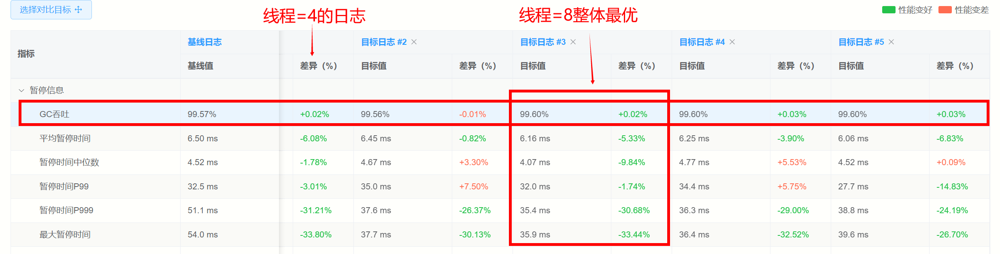

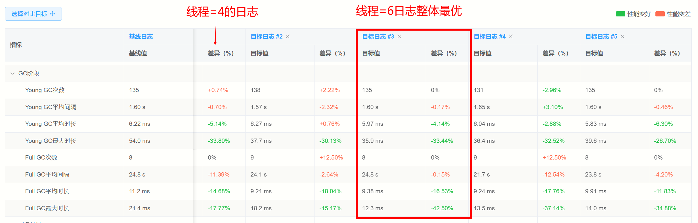


#### 5.2.2 NewRatio年轻代与老年代比例-1G6线程

**JVM修改参数：-NewRatio=n**

本参数改动，基于堆内存1G、6线程数进行设置

**参数设置**：Java 8

```
-XX:+UseParallelGC
-XX:ParallelGCThreads=6
-Xms1G
-Xmx1G
-Xloggc:gc.log
-XX:+PrintGCDetails
```

-XX:NewRatio=1、2、3、4、5、6、7、8、9

**分析日志**：

1. 随着NewRatio=1增加，GC吞吐量呈现先下降（NewRatio1-2）再上升（NewRatio4-9）
2. 随着NewRatio=1增加，Yong GC次数先增加（1-6）再略微下降（7-9）趋势
3. 随着NewRatio=1增加，Old GC次数成稳步上升的趋势

**总结**：

1. NewRatio=2（jvm参数默认）时，Young GC次数属于平均数，Full GC次数属于较少次数，但是因为GC时间较长，导致吞吐量相对较小
2. NewRatio=3、5、7、8、9 时，GC吞吐量是最佳，增幅相比于基准（NewRatio=1）提升大于0.2%。GC仅在7的时候，Young GC次数最少，但是Full GC次数最大（增幅最大），因为是GC次数略增幅的同时，GC时间逐步减少，所以导致，NewRatio在7、8、9的时候吞吐量最大。
3. NewRatio=3、5的时候，Young GC次数相对减少，Full GC次数相对增加，但是因为GC时间较短，导致吞吐量在3、5的时候吞吐量最大

**综上，我们将关注NewRatio=3、5、7、8、9在年轻代中Eden区与Survivor区的比例**

**日志位置**：

<details>
    <summary>点击展开/折叠</summary>

[ParallelGCThreads6_Xmx1G_Xms1G_NewRatio1log](./gclogs/ParallelGCThreads6_Xmx1G_Xms1G_NewRatio1.log)

[ParallelGCThreads6_Xmx1G_Xms1G_NewRatio2log](./gclogs/ParallelGCThreads6_Xmx1G_Xms1G_NewRatio2.log)

[ParallelGCThreads6_Xmx1G_Xms1G_NewRatio3log](./gclogs/ParallelGCThreads6_Xmx1G_Xms1G_NewRatio3.log)

[ParallelGCThreads6_Xmx1G_Xms1G_NewRatio4log](./gclogs/ParallelGCThreads6_Xmx1G_Xms1G_NewRatio4.log)

[ParallelGCThreads6_Xmx1G_Xms1G_NewRatio5log](./gclogs/ParallelGCThreads6_Xmx1G_Xms1G_NewRatio5.log)

[ParallelGCThreads6_Xmx1G_Xms1G_NewRatio6log](./gclogs/ParallelGCThreads6_Xmx1G_Xms1G_NewRatio6.log)

[ParallelGCThreads6_Xmx1G_Xms1G_NewRatio7log](./gclogs/ParallelGCThreads6_Xmx1G_Xms1G_NewRatio7.log)

[ParallelGCThreads6_Xmx1G_Xms1G_NewRatio8log](./gclogs/ParallelGCThreads6_Xmx1G_Xms1G_NewRatio8.log)

[ParallelGCThreads6_Xmx1G_Xms1G_NewRatio8log](./gclogs/ParallelGCThreads6_Xmx1G_Xms1G_NewRatio8.log)

</detail>

**图片分析**：基准ParallelGCThreads6_Xmx1G_Xms1G_NewRatio2

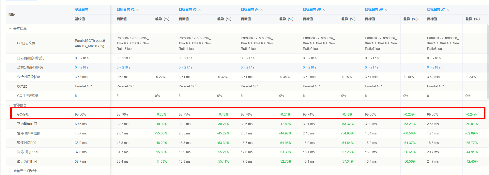

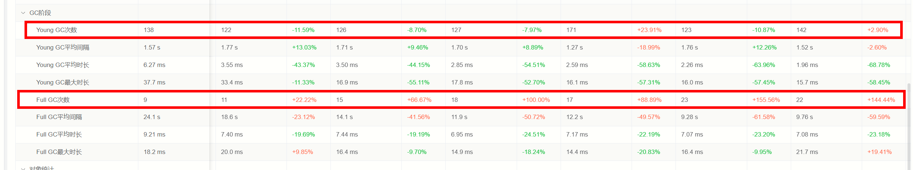

#### 5.2.3 Eden:SurvivorRatio

**JVM修改参数：-new_ratio=n, -XX:SurvivorRatio=n**

本参数改动，基于**堆内存1G、6线程数**进行设置.

new_ratio = [3, 5, 7, 8, 9]

survivor_ratio = [1, 2, 3, 4, 5, 6, 7, 8, 9, 10, 11, 12, 13]

**参数设置**：Java 8

```
-XX:+UseParallelGC
-XX:ParallelGCThreads=6
-Xms1G
-Xmx1G
-Xloggc:gc.log
-XX:+PrintGCDetails
```

-XX:NewRatio=[3, 5, 7, 8, 9]

-XX:SurvivorRatio= [1, 2, 3, 4, 5, 6, 7, 8, 9, 10, 11, 12, 13]

**分析日志**：

1. 当NewRatio=3时，随着SurvivorRatio=1的增加，整体吞吐量都没有大的波动（0.05%），Young GC次数，逐步提升，极个别超出20%（SurRatio9-13），导致对应的吞吐量下降。**最佳表现：NewRatio=3 + SurvivorRatio=5  --> GC吞吐：99.77%**
2. 当NewRatio=5时，随着SurvivorRatio=1的增加，整体吞吐量没有太大波动（0.05%）。Young GC次数，略微下降，Full GC次数轻微浮动。**最佳表现：NewRatio=5 + SurvivorRatio=11  --> GC吞吐：99.79%**
3. 当NewRatio=7时，随着SurvivorRatio=1的增加，整体吞吐量都没有大的波动（0.1%），Young GC次数先增加逐渐减少（123 --> 272-->136），但是Full GC次数略微减少（23-->20）**最佳表现：NewRatio=7 + SurvivorRatio=5  --> GC吞吐：99.81%**
4. 当NewRatio=8时，随着SurvivorRatio=1的增加，整体吞吐量都没有大的波动（0.05%），Young GC次数逐渐减少（142--> 119），但是Full GC次浮动不大（22-26）**最佳表现：NewRatio=8 + SurvivorRatio=8/12  --> GC吞吐：99.82%**。
5. 当NewRatio=9时，随着SurvivorRatio=1的增加，整体吞吐量逐步上升（99.68%-->99.81），Young GC次数逐渐减少（最低283-> 127），但是Full GC次浮动不大（26-->22）**最佳表现：NewRatio=9 + SurvivorRatio=10/13  --> GC吞吐：99.81%**


**日志位置**：

<details>
    <summary>点击展开/折叠</summary>

[ParallelGCThreads6_Xmx1G_Xms1G_NewRatio3_SurRatio1.log](./gclogs/ParallelGCThreads6_Xmx1G_Xms1G_NewRatio3_SurRatio1.log)

[ParallelGCThreads6_Xmx1G_Xms1G_NewRatio3_SurRatio2.log](./gclogs/ParallelGCThreads6_Xmx1G_Xms1G_NewRatio3_SurRatio2.log)

[ParallelGCThreads6_Xmx1G_Xms1G_NewRatio3_SurRatio3.log](./gclogs/ParallelGCThreads6_Xmx1G_Xms1G_NewRatio3_SurRatio3.log)

[ParallelGCThreads6_Xmx1G_Xms1G_NewRatio3_SurRatio4.log](./gclogs/ParallelGCThreads6_Xmx1G_Xms1G_NewRatio3_SurRatio4.log)

[ParallelGCThreads6_Xmx1G_Xms1G_NewRatio3_SurRatio5.log](./gclogs/ParallelGCThreads6_Xmx1G_Xms1G_NewRatio3_SurRatio5.log)

[ParallelGCThreads6_Xmx1G_Xms1G_NewRatio3_SurRatio6.log](./gclogs/ParallelGCThreads6_Xmx1G_Xms1G_NewRatio3_SurRatio6.log)

[ParallelGCThreads6_Xmx1G_Xms1G_NewRatio3_SurRatio7.log](./gclogs/ParallelGCThreads6_Xmx1G_Xms1G_NewRatio3_SurRatio7.log)

[ParallelGCThreads6_Xmx1G_Xms1G_NewRatio3_SurRatio8.log](./gclogs/ParallelGCThreads6_Xmx1G_Xms1G_NewRatio3_SurRatio8.log)

[ParallelGCThreads6_Xmx1G_Xms1G_NewRatio3_SurRatio9.log](./gclogs/ParallelGCThreads6_Xmx1G_Xms1G_NewRatio3_SurRatio1.log)

[ParallelGCThreads6_Xmx1G_Xms1G_NewRatio3_SurRatio9.log](./gclogs/ParallelGCThreads6_Xmx1G_Xms1G_NewRatio3_SurRatio10.log)

[ParallelGCThreads6_Xmx1G_Xms1G_NewRatio3_SurRatio11.log](./gclogs/ParallelGCThreads6_Xmx1G_Xms1G_NewRatio3_SurRatio11.log)

[ParallelGCThreads6_Xmx1G_Xms1G_NewRatio3_SurRatio12.log](./gclogs/ParallelGCThreads6_Xmx1G_Xms1G_NewRatio3_SurRatio12.log)

[ParallelGCThreads6_Xmx1G_Xms1G_NewRatio3_SurRatio13.log](./gclogs/ParallelGCThreads6_Xmx1G_Xms1G_NewRatio3_SurRatio13.log)

[ParallelGCThreads6_Xmx1G_Xms1G_NewRatio5_SurRatio1.log](./gclogs/ParallelGCThreads6_Xmx1G_Xms1G_NewRatio5_SurRatio1.log)

[ParallelGCThreads6_Xmx1G_Xms1G_NewRatio5_SurRatio2.log](./gclogs/ParallelGCThreads6_Xmx1G_Xms1G_NewRatio5_SurRatio2.log)

[ParallelGCThreads6_Xmx1G_Xms1G_NewRatio5_SurRatio3.log](./gclogs/ParallelGCThreads6_Xmx1G_Xms1G_NewRatio3_SurRatio5.log)

[ParallelGCThreads6_Xmx1G_Xms1G_NewRatio5_SurRatio4.log](./gclogs/ParallelGCThreads6_Xmx1G_Xms1G_NewRatio5_SurRatio4.log)

[ParallelGCThreads6_Xmx1G_Xms1G_NewRatio5_SurRatio5.log](./gclogs/ParallelGCThreads6_Xmx1G_Xms1G_NewRatio5_SurRatio5.log)

[ParallelGCThreads6_Xmx1G_Xms1G_NewRatio5_SurRatio6.log](./gclogs/ParallelGCThreads6_Xmx1G_Xms1G_NewRatio5_SurRatio6.log)

[ParallelGCThreads6_Xmx1G_Xms1G_NewRatio5_SurRatio7.log](./gclogs/ParallelGCThreads6_Xmx1G_Xms1G_NewRatio5_SurRatio7.log)

[ParallelGCThreads6_Xmx1G_Xms1G_NewRatio5_SurRatio8.log](./gclogs/ParallelGCThreads6_Xmx1G_Xms1G_NewRatio5_SurRatio8.log)

[ParallelGCThreads6_Xmx1G_Xms1G_NewRatio5_SurRatio9.log](./gclogs/ParallelGCThreads6_Xmx1G_Xms1G_NewRatio5_SurRatio1.log)

[ParallelGCThreads6_Xmx1G_Xms1G_NewRatio5_SurRatio9.log](./gclogs/ParallelGCThreads6_Xmx1G_Xms1G_NewRatio5_SurRatio10.log)

[ParallelGCThreads6_Xmx1G_Xms1G_NewRatio5_SurRatio11.log](./gclogs/ParallelGCThreads6_Xmx1G_Xms1G_NewRatio5_SurRatio11.log)

[ParallelGCThreads6_Xmx1G_Xms1G_NewRatio5_SurRatio12.log](./gclogs/ParallelGCThreads6_Xmx1G_Xms1G_NewRatio5_SurRatio12.log)

[ParallelGCThreads6_Xmx1G_Xms1G_NewRatio5_SurRatio13.log](./gclogs/ParallelGCThreads6_Xmx1G_Xms1G_NewRatio5_SurRatio13.log)

[ParallelGCThreads6_Xmx1G_Xms1G_NewRatio7_SurRatio1.log](./gclogs/ParallelGCThreads6_Xmx1G_Xms1G_NewRatio7_SurRatio1.log)

[ParallelGCThreads6_Xmx1G_Xms1G_NewRatio7_SurRatio2.log](./gclogs/ParallelGCThreads6_Xmx1G_Xms1G_NewRatio7_SurRatio2.log)

[ParallelGCThreads6_Xmx1G_Xms1G_NewRatio7_SurRatio3.log](./gclogs/ParallelGCThreads6_Xmx1G_Xms1G_NewRatio7_SurRatio5.log)

[ParallelGCThreads6_Xmx1G_Xms1G_NewRatio7_SurRatio4.log](./gclogs/ParallelGCThreads6_Xmx1G_Xms1G_NewRatio7_SurRatio4.log)

[ParallelGCThreads6_Xmx1G_Xms1G_NewRatio7_SurRatio5.log](./gclogs/ParallelGCThreads6_Xmx1G_Xms1G_NewRatio7_SurRatio5.log)

[ParallelGCThreads6_Xmx1G_Xms1G_NewRatio7_SurRatio6.log](./gclogs/ParallelGCThreads6_Xmx1G_Xms1G_NewRatio7_SurRatio6.log)

[ParallelGCThreads6_Xmx1G_Xms1G_NewRatio7_SurRatio7.log](./gclogs/ParallelGCThreads6_Xmx1G_Xms1G_NewRatio7_SurRatio7.log)

[ParallelGCThreads6_Xmx1G_Xms1G_NewRatio7_SurRatio8.log](./gclogs/ParallelGCThreads6_Xmx1G_Xms1G_NewRatio7_SurRatio8.log)

[ParallelGCThreads6_Xmx1G_Xms1G_NewRatio7_SurRatio9.log](./gclogs/ParallelGCThreads6_Xmx1G_Xms1G_NewRatio7_SurRatio1.log)

[ParallelGCThreads6_Xmx1G_Xms1G_NewRatio7_SurRatio9.log](./gclogs/ParallelGCThreads6_Xmx1G_Xms1G_NewRatio7_SurRatio10.log)

[ParallelGCThreads6_Xmx1G_Xms1G_NewRatio7_SurRatio11.log](./gclogs/ParallelGCThreads6_Xmx1G_Xms1G_NewRatio7_SurRatio11.log)

[ParallelGCThreads6_Xmx1G_Xms1G_NewRatio7_SurRatio12.log](./gclogs/ParallelGCThreads6_Xmx1G_Xms1G_NewRatio7_SurRatio12.log)

[ParallelGCThreads6_Xmx1G_Xms1G_NewRatio7_SurRatio13.log](./gclogs/ParallelGCThreads6_Xmx1G_Xms1G_NewRatio7_SurRatio13.log)

[ParallelGCThreads6_Xmx1G_Xms1G_NewRatio8_SurRatio1.log](./gclogs/ParallelGCThreads6_Xmx1G_Xms1G_NewRatio8_SurRatio1.log)

[ParallelGCThreads6_Xmx1G_Xms1G_NewRatio8_SurRatio2.log](./gclogs/ParallelGCThreads6_Xmx1G_Xms1G_NewRatio8_SurRatio2.log)

[ParallelGCThreads6_Xmx1G_Xms1G_NewRatio8_SurRatio3.log](./gclogs/ParallelGCThreads6_Xmx1G_Xms1G_NewRatio8_SurRatio5.log)

[ParallelGCThreads6_Xmx1G_Xms1G_NewRatio8_SurRatio4.log](./gclogs/ParallelGCThreads6_Xmx1G_Xms1G_NewRatio8_SurRatio4.log)

[ParallelGCThreads6_Xmx1G_Xms1G_NewRatio8_SurRatio5.log](./gclogs/ParallelGCThreads6_Xmx1G_Xms1G_NewRatio8_SurRatio5.log)

[ParallelGCThreads6_Xmx1G_Xms1G_NewRatio8_SurRatio6.log](./gclogs/ParallelGCThreads6_Xmx1G_Xms1G_NewRatio8_SurRatio6.log)

[ParallelGCThreads6_Xmx1G_Xms1G_NewRatio8_SurRatio7.log](./gclogs/ParallelGCThreads6_Xmx1G_Xms1G_NewRatio8_SurRatio7.log)

[ParallelGCThreads6_Xmx1G_Xms1G_NewRatio8_SurRatio8.log](./gclogs/ParallelGCThreads6_Xmx1G_Xms1G_NewRatio8_SurRatio8.log)

[ParallelGCThreads6_Xmx1G_Xms1G_NewRatio8_SurRatio9.log](./gclogs/ParallelGCThreads6_Xmx1G_Xms1G_NewRatio8_SurRatio1.log)

[ParallelGCThreads6_Xmx1G_Xms1G_NewRatio8_SurRatio9.log](./gclogs/ParallelGCThreads6_Xmx1G_Xms1G_NewRatio8_SurRatio10.log)

[ParallelGCThreads6_Xmx1G_Xms1G_NewRatio8_SurRatio11.log](./gclogs/ParallelGCThreads6_Xmx1G_Xms1G_NewRatio8_SurRatio11.log)

[ParallelGCThreads6_Xmx1G_Xms1G_NewRatio8_SurRatio12.log](./gclogs/ParallelGCThreads6_Xmx1G_Xms1G_NewRatio8_SurRatio12.log)

[ParallelGCThreads6_Xmx1G_Xms1G_NewRatio8_SurRatio13.log](./gclogs/ParallelGCThreads6_Xmx1G_Xms1G_NewRatio8_SurRatio13.log)

[ParallelGCThreads6_Xmx1G_Xms1G_NewRatio9_SurRatio1.log](./gclogs/ParallelGCThreads6_Xmx1G_Xms1G_NewRatio9_SurRatio1.log)

[ParallelGCThreads6_Xmx1G_Xms1G_NewRatio9_SurRatio2.log](./gclogs/ParallelGCThreads6_Xmx1G_Xms1G_NewRatio9_SurRatio2.log)

[ParallelGCThreads6_Xmx1G_Xms1G_NewRatio9_SurRatio3.log](./gclogs/ParallelGCThreads6_Xmx1G_Xms1G_NewRatio9_SurRatio5.log)

[ParallelGCThreads6_Xmx1G_Xms1G_NewRatio9_SurRatio4.log](./gclogs/ParallelGCThreads6_Xmx1G_Xms1G_NewRatio9_SurRatio4.log)

[ParallelGCThreads6_Xmx1G_Xms1G_NewRatio9_SurRatio5.log](./gclogs/ParallelGCThreads6_Xmx1G_Xms1G_NewRatio9_SurRatio5.log)

[ParallelGCThreads6_Xmx1G_Xms1G_NewRatio9_SurRatio6.log](./gclogs/ParallelGCThreads6_Xmx1G_Xms1G_NewRatio9_SurRatio6.log)

[ParallelGCThreads6_Xmx1G_Xms1G_NewRatio9_SurRatio7.log](./gclogs/ParallelGCThreads6_Xmx1G_Xms1G_NewRatio9_SurRatio7.log)

[ParallelGCThreads6_Xmx1G_Xms1G_NewRatio9_SurRatio8.log](./gclogs/ParallelGCThreads6_Xmx1G_Xms1G_NewRatio9_SurRatio8.log)

[ParallelGCThreads6_Xmx1G_Xms1G_NewRatio9_SurRatio9.log](./gclogs/ParallelGCThreads6_Xmx1G_Xms1G_NewRatio9_SurRatio1.log)

[ParallelGCThreads6_Xmx1G_Xms1G_NewRatio9_SurRatio9.log](./gclogs/ParallelGCThreads6_Xmx1G_Xms1G_NewRatio9_SurRatio10.log)

[ParallelGCThreads6_Xmx1G_Xms1G_NewRatio9_SurRatio11.log](./gclogs/ParallelGCThreads6_Xmx1G_Xms1G_NewRatio9_SurRatio11.log)

[ParallelGCThreads6_Xmx1G_Xms1G_NewRatio9_SurRatio12.log](./gclogs/ParallelGCThreads6_Xmx1G_Xms1G_NewRatio9_SurRatio12.log)

[ParallelGCThreads6_Xmx1G_Xms1G_NewRatio9_SurRatio13.log](./gclogs/ParallelGCThreads6_Xmx1G_Xms1G_NewRatio9_SurRatio13.log)

</detail>

**图片分析**：基准ParallelGCThreads6_Xmx1G_Xms1G_NewRatio3/5/7/8/9

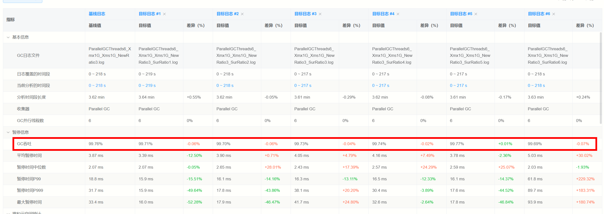

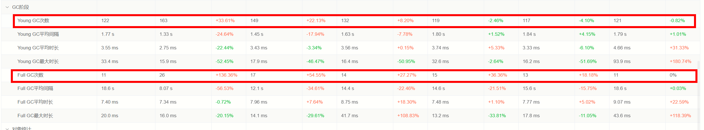

#### 总结：

1. 当NewRatio=3/5时，代表年轻代区域相对大（大于默认值2），当SurvivorRatio增加，Eden区域变大时，有更多的内存在年轻代部分进行处理；因此，NewRatio=5时，主要的Full GC次数相对减少，因此导致GC吞吐量时最大的
2. 当NewRatio=7-9时，代表年轻代区域小，但因为1G的堆内存，导致当SurvivorRatio增加的时候，Eden区域变大，更多内存在年轻代部分处理，GC次数下降快。老年代区域大，这也是为什么Full GC次数略微下降的原因。但因为Young GC次数过大（即使年轻代区域小，每次GC时间短）导致吞吐量无法上升。只有依靠，增加Eden区域来减少Young GC次数。
3. **当NewRatio=8时，**SurvivorRatio=1-13整体GC次数较少，变动不大，基本都在99.80%左右浮动（0.03~）是一个整体不错的Jvm参数

**综上：**当内存为1G时，NewRatio=8（jvm默认参数） + SurvivorRatio=8/12  --> GC吞吐：**99.82%**为最佳，原因如[分析日志](分析日志)。


#### 在最好的几组里面和[old 面积大点，young小点的表现好的] 设置控制大对象直接进入老年代

#### 设置不同GC算法，在同一个java17下面程序的表现情况，[512m, 1G, 2G]，模拟一下情况

**G1GC: To-space exhausted -> Full GC**
**ZGC: Allocation Stall**
**Shenandoah GC: Pacing >Degenerated GC → Full GC**
