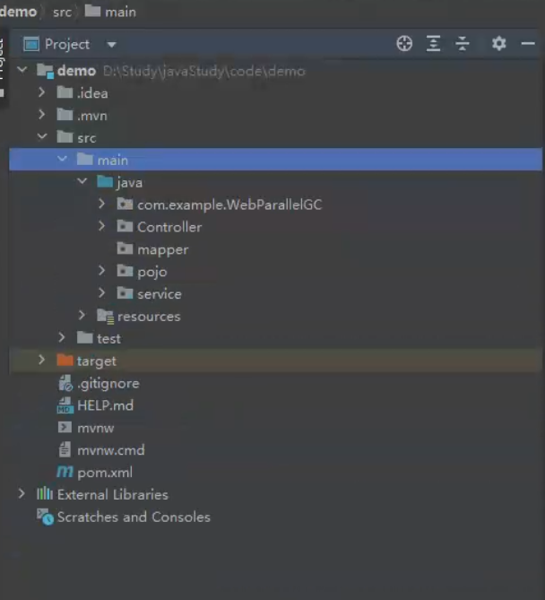

# 陈迅雷_ratSquealer_ParallelGC_1week

## 背景

一般的应用程序，对于GC的选择不是特别重要，应用程序可以在垃圾收集的情况下以适度的频率和持续时间暂停，表现良好。

但是对于拥有大量数据、多线程和高事务率的应用程序需要设计对应的GC和参数。

针对Parallel GC，编写程序模拟内存分配与垃圾回收场景，能够反应出该GC的特点。解释它的GC日志。修改程序或JVM参数以达成特定目标，如更低的GC延迟。

## 初步设计

### 考虑方面：

Parallel GC 的内存分配与垃圾回收场景反映其特点的几个方面包括：

1. **年轻代垃圾回收**：多线程进行垃圾收集，加速年轻代对象的清理。
2. **老年代垃圾回收**：多线程处理老年代对象，提高吞吐量。
3. **暂停时间**：尽量降低暂停时间，提高应用程序的响应速度。
4. **吞吐量优化**：提高总体吞吐量，应对高效处理大量事务的应用程序。

### 任务分解

1. 设计内存分配与垃圾回收场景
2. 编写程序模拟场景
3. 修改程序或JVM参数以达成特定目标

### 模拟内存分配与垃圾回收场景

#### **场景一：高并发请求处理**

一个基于Java的Web服务器，它使用Parallel GC处理高并发请求。

**流程规划**

1. Spring Initializr来生成一个Spring Boot项目。
2. 编写控制器程序来处理HTTP请求。
3. 编写主应用程序类来启动Spring Boot应用。
4. 设置JVM参数并运行验证高并发处理。
5. 启用GC日志记录，解释日志，修改程序或JVM参数以**达成特定目标**。

## 特定目标（待定）

1. 确定模拟场景
2. 确定目标的参数指标

## 暂定工具

1. Apache JMeter（模拟高并发）
2. VisualVM（可视化GC）
3. IntelliJ IDEA（编写程序）

## 其他

导师您好，因为对于GC方面的issue（ParallelGC）是一个小白。

首先我第1周是对相关工具知识进行了解，希望能尽量往正确的方向使力，希望导师能确认一下当前研究方向是否正确。

其次我不太明白场景的模拟是否正确和如何确定参数指标，希望能得到您的指导。

最后本周工作有错误或不完善的地方，希望能在您的指导下进行修正，能进行微信/QQ上进行指导，最终解决该issue。十分感谢！

